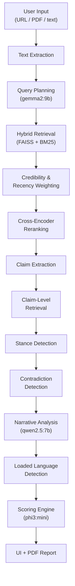
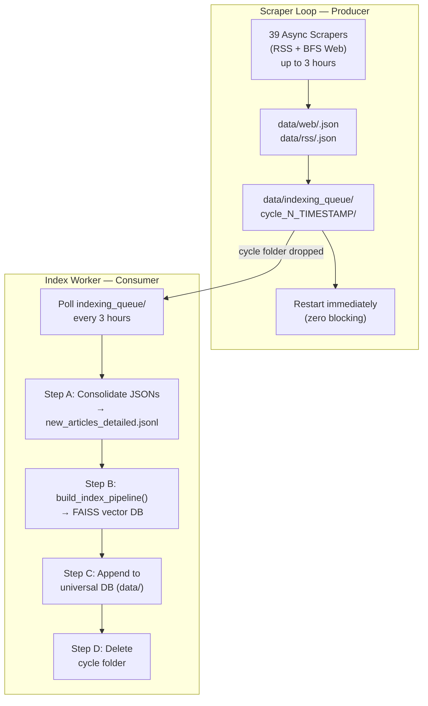

# 🧠 Evidence-Based News Bias Analyzer

> A local-first AI system for detecting bias in news articles through multi-source retrieval, structured reasoning, and explainable scoring — entirely on your own machine.

---

## Overview

This project builds a complete end-to-end pipeline that takes a news article as input and produces a detailed bias report. It works by scraping real news from dozens of sources, building semantic search indexes, and then cross-referencing every claim in your article against retrieved evidence from those sources.

The system runs fully offline using [Ollama](https://ollama.com/) for all AI inference — no API keys, no cloud dependencies.

**Key capabilities:**
- Hybrid retrieval (FAISS semantic + BM25 lexical) across per-publisher indexes
- Claim-level stance detection and contradiction analysis
- Narrative framing and loaded language scoring
- Continuous scraping pipeline with a producer-consumer architecture
- Streamlit dashboard + downloadable PDF reports

---

## Architecture

### End-to-End Analysis Flow



### Scraping & Indexing Pipeline (Producer-Consumer)



---

## Project Structure

```
.
├── streamlit_app.py              # Streamlit dashboard entry point
├── requirements.txt
├── .env                          # Crawler configuration (optional)
├── SCRAPING_TO_FAISS_HANDOFF.md  # Handoff guide for the indexing pipeline
│
├── app/
│   ├── main.py                   # CLI entry point (4 modes)
│   │
│   ├── analysis/                 # Core reasoning layer
│   │   ├── bias_detector.py      # Main pipeline orchestrator
│   │   ├── claim_extractor.py    # Heuristic claim extraction
│   │   ├── stance_detector.py    # Claim ↔ evidence stance classification
│   │   ├── contradiction_detector.py
│   │   ├── narrative_analyzer.py # LLM-based framing analysis
│   │   ├── scoring_v2.py         # Calibrated scoring engine
│   │   ├── summarizer.py         # Evidence summarization + deduplication
│   │   ├── lexicon.py            # Loaded language categories + weights
│   │   └── json_utils.py         # Structured LLM output with retries
│   │
│   ├── retrieval/                # Hybrid retrieval system
│   │   ├── faiss_retriever.py    # Main retrieval orchestrator
│   │   ├── hybrid_search.py      # FAISS + BM25 fusion per site
│   │   ├── cross_encoder_reranker.py
│   │   ├── query_planner.py      # LLM-based retrieval planning
│   │   ├── index_loader.py       # Per-site index loading with LRU cache
│   │   ├── weighting.py          # Recency + credibility score weighting
│   │   └── constants.py          # Credibility scores per publisher
│   │
│   ├── embeddings/               # Vector pipeline
│   │   ├── build_index.py        # Per-domain incremental FAISS builder
│   │   ├── embed.py              # Ollama embedding with backoff
│   │   ├── vector_store.py       # FAISS index I/O + append logic
│   │   └── chunker.py            # Overlapping text chunking
│   │
│   ├── input/                    # Scraping system
│   │   └── news_pipeline/
│   │       ├── scheduler.py      # Producer-consumer orchestrator
│   │       ├── crawler.py        # Async crawl loop (one task per source)
│   │       ├── scrapers/
│   │       │   ├── base.py       # Abstract scraper + JSON I/O
│   │       │   ├── rss_scraper.py
│   │       │   └── web_scraper.py  # BFS crawler (no depth limit)
│   │       ├── extractors.py     # HTML parsing, RSS parsing, tag generation
│   │       ├── config.py         # Source definitions + CrawlSettings
│   │       ├── metadata_gate.py  # URL deduplication gate
│   │       └── scheduler.py
│   │
│   ├── evaluation/               # Evaluation harness
│   │   ├── dataset_loader.py
│   │   └── run_evaluation.py
│   │
│   └── prompts/
│       └── bias_prompt.txt
│
└── data/                         # Runtime data (git-ignored)
    ├── web/                      # Scraped web articles (temporary)
    ├── rss/                      # Scraped RSS articles (temporary)
    ├── indexing_queue/           # Staging zone between scraper and indexer
    └── new_articles_detailed.jsonl  # Master article archive
```

---

## Models (via Ollama)

| Task               | Model            | Notes                                      |
|--------------------|------------------|--------------------------------------------|
| Embeddings         | nomic-embed-text | Used for both indexing and query embedding |
| Narrative analysis | qwen2.5:7b       | Framing bias + selective emphasis scoring  |
| Query planning     | gemma2:9b        | Retrieval filter generation                |
| Summarization      | gemma2:9b        | Evidence chunk summarization               |
| Scoring            | phi3:mini        | Calibrated bias scoring                    |

Pull all models before running:

```bash
ollama pull nomic-embed-text
ollama pull qwen2.5:7b
ollama pull gemma2:9b
ollama pull phi3:mini
```

---

## Setup & Running

### 1. Install dependencies

```bash
pip install -r requirements.txt
```

### 2. Start Ollama

```bash
ollama serve
```

### 3. Run the application

```bash
python app/main.py
```

This presents a menu with four options:

```
1 → Start Continuous Scraper Loop       (runs in Terminal A)
2 → Start Index Scanner (FAISS Builder) (runs in Terminal B)
3 → Launch Streamlit Dashboard          (opens in browser)
4 → Run Manual Bias Analyzer Test       (CLI test)
```

For full operation, run options **1** and **2** simultaneously in separate terminals, then open the dashboard with option **3**.

### Streamlit UI only

```bash
streamlit run streamlit_app.py
```

### Run scraper standalone

```bash
python -m app.input.scraper
```

---

## Analysis Pipeline — In Detail

### Claim Extraction

Claims are extracted heuristically from the input article. A sentence is considered a meaningful claim if it:
- Contains a factual verb (`said`, `confirmed`, `announced`, `found`, etc.)
- Includes numeric values or named entities
- Is at least 7 words long and is not a question

Extracted claims are deduplicated using token-overlap Jaccard similarity (threshold: 75%) and ranked by informativeness before the top 7 are selected.

### Hybrid Retrieval

For each claim, the system queries every loaded per-site FAISS index using:

- **FAISS** (cosine similarity on `nomic-embed-text` vectors) — weight: 0.6
- **BM25** (lexical keyword match, normalized) — weight: 0.4

Results from all sites are merged, credibility-weighted, recency-boosted, and passed through a cross-encoder reranker (also using `nomic-embed-text`). An LLM-based query planner (gemma2:9b) optionally filters by source, topic, or recency before retrieval.

**Fallback chain:** FAISS + BM25 → BM25-only (if embedding fails) → empty result handling with diagnostics.

### Stance Detection

Each retrieved evidence chunk is classified against the claim it was retrieved for:

- `SUPPORT` — semantic + lexical similarity above threshold, no negation conflict
- `CONTRADICT` — numeric conflict or negation mismatch with high confidence
- `NEUTRAL` — weak or off-topic alignment

Stance is determined heuristically using Jaccard similarity, cosine similarity (Counter-based TF), named entity overlap, numeric comparison, and negation detection — no LLM call required.

### Contradiction Detection

Contradictions are flagged at the claim level when:
- At least one source strongly supports the claim (confidence ≥ 0.65)
- At least one other source strongly contradicts it (confidence ≥ 0.75, or ≥ 0.85 for non-numeric conflicts)
- At least 2 contradictory evidence items exist

Contradictions are typed as `factual` (numeric/entity conflict) or `narrative` (framing-level disagreement).

### Narrative Analysis

The narrative analysis module compares the article's opening framing against retrieved source texts using `qwen2.5:7b`. It scores two dimensions:

- **Framing bias score** — emotional loading, alarm language, unresolved tension
- **Selective emphasis score** — omissions or over-emphasis relative to sources

A lexicon-based fallback is used when the LLM call fails or evidence is unavailable.

### Loaded Language Detection

The system scans every sentence for terms from a categorized lexicon:

| Category              | Example terms                                  | Weight |
|-----------------------|------------------------------------------------|--------|
| `alarmist`            | catastrophic, devastating, terrifying          | 1.00   |
| `certainty_overclaim` | clearly, obviously, undeniably, proven         | 1.15   |
| `conflict_escalation` | escalation, showdown, retaliation, radical     | 1.20   |
| `moral_judgment`      | reckless, shameful, corrupt, dangerous         | 1.35   |
| `propaganda_framing`  | regime, cover-up, mouthpiece, so-called        | 1.50   |
| `derision_ridicule`   | laughable, absurd, pathetic, ridiculous        | 1.25   |

The UI displays a category distribution chart, highlighted sentences, and per-word annotations.

### Scoring

Final scores are computed from four components:

| Metric           | Key inputs                                                         | Weight |
|------------------|--------------------------------------------------------------------|--------|
| Factual accuracy | Support ratio, evidence density, stance confidence, contradictions | 0.35   |
| Narrative bias   | Framing bias score + selective emphasis score                      | 0.25   |
| Completeness     | Viewpoint imbalance, evidence density, support ratio               | 0.20   |
| Confidence       | Evidence density, stance confidence, contradiction rate            | 0.20   |

A single `final_score` is computed as a weighted combination (higher = less biased/more complete).

---

## Source Credibility Scores

The retrieval system applies credibility weights when ranking results. Scores are defined in `app/retrieval/constants.py`:

| Publisher             | Score |
|-----------------------|-------|
| Reuters, AP           | 1.00  |
| BBC                   | 0.95  |
| Nature                | 0.95  |
| The Guardian, NPR     | 0.90  |
| Al Jazeera, CNBC      | 0.82  |
| TechCrunch, Wired     | 0.80  |
| The Hindu             | 0.75  |
| Times of India        | 0.68  |
| *(unlisted sources)*  | 0.60  |

Higher-credibility sources use a slightly stricter retrieval threshold (+0.05), ensuring that top-tier sources require stronger semantic alignment before their content is returned.

---

## Scraping Sources

The system scrapes **39 sources** across Indian news, international news, technology, AI/ML, science, business, and aggregators — both via RSS feeds and BFS web crawling. Sources are defined in `app/input/news_pipeline/config.py` and can be extended by appending to `SEED_SOURCE_DEFINITIONS`.

Default crawl cycle: **2 hours** (configurable via `CRAWLER_CYCLE_INTERVAL_MINUTES` in `.env`).

---

## Configuration (`.env`)

```env
CRAWLER_GLOBAL_WORKERS=30
CRAWLER_REQUEST_TIMEOUT_SEC=30
CRAWLER_MAX_RETRIES=3
CRAWLER_CYCLE_INTERVAL_MINUTES=120
OUTPUT_BASE_PATH=app/input/data
```

---

## Evaluation

The evaluation harness runs the full analysis pipeline against a labeled JSON dataset and reports accuracy and cross-run consistency:

```bash
python -m app.evaluation.run_evaluation path/to/dataset.json
```

Expected dataset format:

```json
[
  {
    "id": "001",
    "article_text": "...",
    "expected_bias_label": "low_bias",
    "expected_claim_stances": {}
  }
]
```

Labels are predicted by mapping scores to `low_bias`, `high_bias`, or `mixed`. Test articles for benchmarking can be generated using a local LLM — see the README section on test article generation.

---

## PDF Reports

Generated via Streamlit + PyMuPDF. Reports include:

- Executive summary
- Calibrated scores with visual indicators
- Claim-by-claim verification with evidence
- Contradiction log
- Narrative framing analysis
- Loaded language breakdown
- Source comparison table

---

## Limitations

- **Claim extraction is heuristic** — complex or implicit claims may be missed
- **Stance detection has no LLM step** — relies on lexical/statistical signals; nuanced contradictions may be misclassified
- **Model latency** — full analysis on a mid-range machine takes 30–120 seconds depending on claim count and retrieval results
- **Retrieval quality depends on index freshness** — the scraper must have run recently for the evidence base to be relevant
- **Scoring is still evolving** — calibration was tuned on synthetic test articles and may need adjustment for specific domains

---

## Future Work

- LLM-assisted claim extraction for better coverage of implicit claims
- Stronger contradiction reasoning (currently threshold-based)
- Distributed indexing for larger evidence bases
- Real-time ingestion without the cycle queue
- Advanced evaluation benchmarks on real labeled datasets

---

## License

This project is local-first and privacy-preserving by design. All inference runs on your machine via Ollama. No article text, embeddings, or analysis results leave your system.
