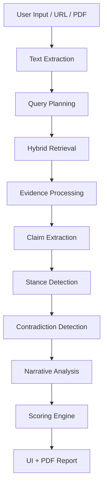

# Evidence-Based News Bias Analyzer

An end-to-end **local-first AI system** for analyzing news articles using multi-source retrieval, structured reasoning, and explainable scoring.

---

# Overview

This project combines:

- Hybrid retrieval (FAISS + BM25 + reranking)
- Claim-level verification
- Stance + contradiction detection
- Narrative & framing analysis
- Calibrated scoring system
- Continuous scraping + indexing pipeline
- Streamlit UI + PDF reports

---

# System Architecture

## End-to-End Analysis Flow



---

# Project Structure

```text
.
+-- streamlit_app.py
+-- README.md
+-- requirements.txt
+-- SCRAPING_TO_FAISS_HANDOFF.md
+-- app/
|   +-- main.py
|   +-- analysis/
|   +-- embeddings/
|   +-- evaluation/
|   +-- input/
|   +-- prompts/
|   +-- retrieval/
+-- data/
+-- logs/
```

---

# Core Modules

## Analysis (app/analysis/)

Core reasoning layer:

- bias detection
- claim extraction
- stance detection
- contradiction detection
- narrative analysis
- scoring (raw + calibrated)
- summarization

Pipeline:

```text
Article → Claims → Evidence → Stance → Contradictions → Narrative → Scores
```

---

## Retrieval (app/retrieval/)

Hybrid retrieval system:

- FAISS semantic search
- BM25 lexical fallback
- hybrid fusion
- reranking (cross-encoder)
- credibility weighting
- recency weighting
- filtering + diversification

Flow:

```text
Query → FAISS + BM25 → Merge → Filter → Rerank → Results
```

### Safeguards

- corrupted index handling
- embedding failure fallback
- reranker fallback
- BM25-only fallback

---

## Embeddings (app/embeddings/)

Vector pipeline:

```text
Articles → Chunking → Embeddings → FAISS Indexes
```

Features:

- incremental indexing
- embedding caching
- per-site indexes
- batching + backoff handling

---

## Input Pipeline (app/input/)

Scraping system:

- RSS scraping
- web scraping (BFS discovery)
- async crawling
- deduplication (metadata gate)
- scheduler-driven cycles

### Scraper Cycle Design

- runs in timed cycles (default: 5 hours)
- moves results to indexing queue
- restarts immediately

---

## Evaluation (app/evaluation/)

Supports:

- dataset loading
- bias label evaluation
- stance evaluation
- aggregate metrics

---

# Detailed Analysis Pipeline

```text
Input Article
  → Retrieval Planning
  → Hybrid Retrieval (FAISS + BM25)
  → Credibility / Recency Weighting
  → Reranking
  → Claim Extraction
  → Claim-Level Retrieval
  → Stance Detection
  → Contradiction Detection
  → Narrative Analysis
  → Loaded Language Detection
  → Evidence Summarization
  → Top-Level Scores
  → Calibrated Scores
```

---

# Scoring System

## Top-Level Metrics

- factual accuracy
- narrative bias
- completeness
- confidence

## Calibrated Metrics

- credibility score
- bias score
- completeness score
- confidence

Component signals:

- factual_accuracy
- narrative_bias
- loaded_language
- evidence_support
- source_reliability
- viewpoint_coverage
- context_depth

---

# Loaded Language Analysis

Categories:

- alarmist
- certainty_overclaim
- conflict_escalation
- moral_judgment
- propaganda_framing
- derision_ridicule

UI includes:

- category distribution charts
- highlighted sentences
- word grouping

---

# Models Required (Ollama)

To run the full pipeline, the following models must be pulled in Ollama. The system uses specific models optimized for each reasoning task.

| Task | Model | Purpose | Pull Command |
| :--- | :--- | :--- | :--- |
| **Embeddings** | `nomic-embed-text` | Vectorizing queries and articles for FAISS retrieval. | `ollama pull nomic-embed-text` |
| **Stance Detection** | `phi3:mini` | Classifying evidence stance (Support/Refute) for claims. | `ollama pull phi3:mini` |
| **Calibrated Scoring** | `phi3:mini` | Calculating final confidence and credibility scores. | `ollama pull phi3:mini` |
| **Summarization** | `gemma2:9b` | Grounded summarization of retrieved evidence chunks. | `ollama pull gemma2:9b` |
| **Narrative Analysis** | `qwen2.5:7b` | Comparing framing and Selective emphasis across sources. | `ollama pull qwen2.5:7b` |
---

# RAM Management & Resource Optimization

To ensure stability on memory-constrained systems, the application uses **On-Demand Model Loading**:

- **Lazy Startup**: No models or indexes are loaded until the "Run Analysis" button is pressed.
- **Unload-on-Idle**: All Ollama models are configured with `keep_alive: "1m"`. They load only when a specific analysis stage starts and are released from RAM 1 minute after the last request in that stage.
- **Incremental Retrieval**: FAISS indexes are loaded site-by-site during the search phase rather than all at once.

---

# Running the Project

## Setup

1. **Install Python dependencies**:
   ```bash
   pip install -r requirements.txt
   ```

2. **Pull All Required Models**:
   ```bash
   ollama pull nomic-embed-text
   ollama pull phi3:mini
   ollama pull gemma2:9b
   ollama pull qwen2.5:7b
   ```

## Run UI

```bash
streamlit run streamlit_app.py
```

## CLI Mode

```bash
python app/main.py
```

Options:

```text
1 → continuous scraper + indexing
2 → manual analyzer
```

---

# Scraping & Indexing

## Scraper

```bash
python -m app.input.scraper
```

Features:

- RSS + web scraping
- BFS discovery
- deduplication
- queue-based indexing handoff

## Index Builder

Located at:

```text
app/embeddings/build_index.py
```

Responsibilties:

- load JSON/JSONL data
- filter valid articles
- chunk text
- reuse embeddings
- build FAISS indexes

---

# PDF Reporting

Generated via Streamlit + PyMuPDF.

Includes:

- summary
- calibrated scores
- evidence context
- claim verification
- contradictions
- narrative analysis
- source comparison
- loaded language

---

# Limitations

- heuristic claim extraction
- model latency varies by hardware
- retrieval noise in edge cases
- scoring still evolving

---

# Strengths

### Multi-Scraper Architecture

- concurrent async scraping across multiple sources
- supports both RSS and full web crawling
- BFS-style discovery for deeper coverage
- per-source configuration and scaling

### Multi-Index FAISS Architecture

- separate FAISS index per publisher/domain
- avoids single-index bottlenecks
- improves retrieval diversity
- enables source-level weighting and filtering

### Hybrid Retrieval System

- FAISS (semantic) + BM25 (lexical)
- fusion of results across multiple sources
- fallback-safe design (works even if embeddings fail)

### Advanced Ranking & Weighting

- cross-encoder reranking
- credibility-based weighting per source
- recency-based scoring adjustments
- adaptive thresholds per site

### Continuous Data Pipeline

- producer-consumer architecture
- scraper and indexing fully decoupled
- automatic FAISS updates
- zero blocking between ingestion and ML pipeline

### Fault Tolerance

- safe fallbacks for embedding failures
- reranker failure recovery
- corrupted index handling
- retry-safe indexing queue

### Evaluation-Ready System

- synthetic test article generation
- structured dataset evaluation
- reproducible benchmarking

### Modular Design

- clean separation of concerns
- independently testable modules
- scalable architecture
- local-first (privacy friendly)
- explainable outputs
- modular architecture
- fault-tolerant pipeline
- production-style ingestion + indexing

---

# Future Work

- improved claim extraction
- stronger contradiction reasoning
- distributed indexing
- real-time ingestion
- advanced evaluation benchmarks
