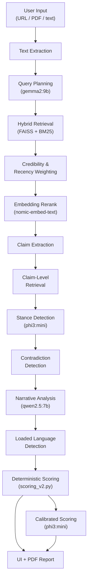
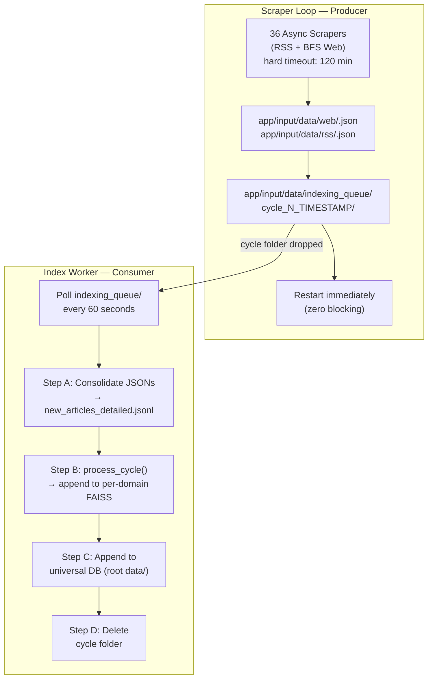

# 🧠 Evidence-Based News Bias Analyzer

> A local-first AI system for detecting bias in news articles through multi-source retrieval, structured reasoning, and explainable scoring — entirely on your own machine.

---

## Overview

This project builds a complete end-to-end pipeline that takes a news article as input and produces a detailed bias report. It works by scraping real news from dozens of sources, building semantic search indexes, and then cross-referencing every claim in your article against retrieved evidence from those sources.

The system runs fully offline using [Ollama](https://ollama.com/) for all AI inference — no API keys, no cloud dependencies.

**Key capabilities:**
- Hybrid retrieval (FAISS semantic + BM25 lexical) across per-publisher indexes
- Claim-level stance detection and contradiction analysis
- Narrative framing and loaded language scoring
- Continuous scraping pipeline with a producer-consumer architecture
- Streamlit dashboard + downloadable PDF reports

---

## Architecture

### End-to-End Analysis Flow


```mermaid
flowchart TD
    A["User Input\n(URL / PDF / text)"]
    B["Text Extraction"]
    C["Query Planning\n(gemma2:9b)"]
    D["Hybrid Retrieval\n(FAISS + BM25)"]
    E["Credibility &\nRecency Weighting"]
    F["Embedding Rerank\n(nomic-embed-text)"]
    G["Claim Extraction"]
    H["Claim-Level\nRetrieval"]
    I["Stance Detection\n(phi3:mini)"]
    J["Contradiction\nDetection"]
    K["Narrative Analysis\n(qwen2.5:7b)"]
    L["Loaded Language\nDetection"]
    M["Deterministic Scoring\n(scoring_v2.py)"]
    M2["Calibrated Scoring\n(phi3:mini)"]
    N["UI + PDF Report"]

    A --> B --> C --> D --> E --> F --> G --> H --> I --> J --> K --> L --> M --> N
    M --> M2 --> N
```

### Scraping & Indexing Pipeline (Producer-Consumer)


```mermaid
flowchart TD
    subgraph PRODUCER["Scraper Loop — Producer"]
        P1["36 Async Scrapers\n(RSS + BFS Web)\nhard timeout: 120 min"]
        P2["app/input/data/web/<source>.json\napp/input/data/rss/<source>.json"]
        P3["app/input/data/indexing_queue/\ncycle_N_TIMESTAMP/"]
        P4["Restart immediately\n(zero blocking)"]
        P1 --> P2 --> P3 --> P4
    end

    subgraph CONSUMER["Index Worker — Consumer"]
        C0["Poll indexing_queue/\nevery 60 seconds"]
        C1["Step A: Consolidate JSONs\n→ new_articles_detailed.jsonl"]
        C2["Step B: process_cycle()\n→ append to per-domain FAISS"]
        C3["Step C: Append to\nuniversal DB (root data/)"]
        C4["Step D: Delete\ncycle folder"]
        C0 --> C1 --> C2 --> C3 --> C4
    end

    P3 -->|"cycle folder dropped"| C0
```

---

## Project Structure

```
.
├── streamlit_app.py              # Streamlit dashboard entry point
├── requirements.txt
├── .env                          # Crawler configuration (optional)
├── SCRAPING_TO_FAISS_HANDOFF.md  # Handoff guide for the indexing pipeline
│
├── app/
│   ├── main.py                   # CLI entry point (4 modes)
│   │
│   ├── analysis/                 # Core reasoning layer
│   │   ├── bias_detector.py      # Main pipeline orchestrator
│   │   ├── claim_extractor.py    # Heuristic claim extraction
│   │   ├── stance_detector.py    # Claim ↔ evidence stance classification
│   │   ├── contradiction_detector.py
│   │   ├── narrative_analyzer.py # LLM-based framing analysis
│   │   ├── scoring_v2.py         # Deterministic scoring (used by analyze_bias)
│   │   ├── scorer.py             # Calibrated LLM scoring (used by Streamlit)
│   │   ├── summarizer.py         # Evidence summarization + deduplication
│   │   ├── lexicon.py            # Loaded language categories + weights
│   │   └── json_utils.py         # Structured LLM output with retries
│   │
│   ├── retrieval/                # Hybrid retrieval system
│   │   ├── faiss_retriever.py    # Main retrieval orchestrator
│   │   ├── hybrid_search.py      # FAISS + BM25 fusion per site
│   │   ├── cross_encoder_reranker.py  # Bi-encoder rerank (see note below)
│   │   ├── query_planner.py      # LLM-based retrieval planning
│   │   ├── index_loader.py       # Per-site index loading, mtime-invalidated cache
│   │   ├── weighting.py          # Recency + credibility score weighting
│   │   └── constants.py          # Credibility scores per publisher
│   │
│   ├── embeddings/               # Vector pipeline
│   │   ├── build_index.py        # Per-domain incremental FAISS builder
│   │   ├── embed.py              # Ollama embedding with backoff
│   │   ├── vector_store.py       # FAISS index I/O + append logic
│   │   └── chunker.py            # Overlapping text chunking
│   │
│   ├── input/                    # Scraping system
│   │   └── news_pipeline/
│   │       ├── scheduler.py      # Producer-consumer orchestrator
│   │       ├── crawler.py        # Async crawl loop (one task per source)
│   │       ├── scrapers/
│   │       │   ├── base.py       # Abstract scraper + JSON I/O
│   │       │   ├── rss_scraper.py
│   │       │   └── web_scraper.py  # BFS crawler (no depth limit)
│   │       ├── extractors.py     # HTML parsing, RSS parsing, tag generation
│   │       ├── config.py         # Source definitions + CrawlSettings
│   │       ├── metadata_gate.py  # URL deduplication gate
│   │       ├── models.py         # Article dataclass
│   │       ├── test_classifier.py  # Article-vs-index-page URL classifier
│   │       └── queue_embedder.py
│   │
│   ├── evaluation/               # Evaluation harness
│   │   ├── dataset_loader.py
│   │   └── run_evaluation.py
│   │
│   └── prompts/
│       └── bias_prompt.txt
│
├── docs/input/                   # Per-module docs for the ingestion layer
│
└── data/                         # Universal article archive (git-ignored)
    ├── web/
    └── rss/
```

### Runtime data layout

None of these directories exist in a fresh clone — they are created on the first
scrape cycle. Two separate roots are involved, which is easy to mix up:

| Path | Written by | Contents |
|------|------------|----------|
| `app/input/data/web/`, `app/input/data/rss/` | Producer | Current cycle's scraped JSON (emptied every cycle) |
| `app/input/data/indexing_queue/cycle_N_*/` | Producer | Staging handoff to the consumer (deleted after indexing) |
| `app/input/data/new_articles_detailed.jsonl` | Consumer | Append-only master article log |
| `app/embeddings/vector_index/<domain>/` | Consumer | Per-publisher `articles.index` + `metadata.json` |
| `data/web/`, `data/rss/` (project root) | Consumer | Universal archive, deduplicated by URL |

The scraper output root is configurable via `OUTPUT_BASE_PATH`; the vector index and
universal archive locations are not.

> **The analyzer cannot produce results until `app/embeddings/vector_index/` is populated.**
> With no indexes, retrieval returns nothing and every claim scores as unsupported. Run the
> scraper and indexer (options 1 and 2) through at least one full cycle before analyzing.

---

## Models (via Ollama)

| Task               | Model            | Defined in                          |
|--------------------|------------------|-------------------------------------|
| Embeddings         | nomic-embed-text | `embeddings/embed.py`               |
| Query embedding    | nomic-embed-text | `retrieval/faiss_retriever.py`      |
| Reranking          | nomic-embed-text | `retrieval/cross_encoder_reranker.py` |
| Stance detection   | phi3:mini        | `analysis/stance_detector.py`       |
| Narrative analysis | qwen2.5:7b       | `analysis/narrative_analyzer.py`    |
| Query planning     | gemma2:9b        | `retrieval/query_planner.py`        |
| Summarization      | gemma2:9b        | `analysis/summarizer.py`            |
| Calibrated scoring | phi3:mini        | `analysis/scorer.py`                |

Pull all models before running:

```bash
ollama pull nomic-embed-text
ollama pull qwen2.5:7b
ollama pull gemma2:9b
ollama pull phi3:mini
```

---

## Setup & Running

### 1. Install Ollama

Ollama is a native application, **not** a pip package — install it from
[ollama.com](https://ollama.com) before installing the Python dependencies.

### 2. Install dependencies

```bash
pip install -r requirements.txt
```

### 3. Start Ollama

```bash
ollama serve
```

### 4. Run the application

```bash
python app/main.py
```

This presents a menu with four options:

```
1 → Start Continuous Scraper Loop       (runs in Terminal A)
2 → Start Index Scanner (FAISS Builder) (runs in Terminal B)
3 → Launch Streamlit Dashboard          (opens in browser)
4 → Run Manual Bias Analyzer Test       (CLI test)
```

For full operation, run options **1** and **2** simultaneously in separate terminals, then open the dashboard with option **3**.

**On a fresh clone, order matters.** There is no evidence base until the scraper has completed a cycle and the indexer has consumed it, so start 1 and 2 first and leave them running. With the default 120-minute cycle, the first indexes appear roughly two hours in; set `CRAWLER_CYCLE_INTERVAL_MINUTES` to something small (e.g. `10`) for a quicker first build. The dashboard runs before then, but every claim will come back unsupported.

### Streamlit UI only

```bash
streamlit run streamlit_app.py
```

### Run scraper standalone

```bash
python -m app.input.scraper
```

---

## Analysis Pipeline — In Detail

### Claim Extraction

Claims are extracted heuristically from the input article. A sentence is considered a meaningful claim if it:
- Contains a factual verb (`said`, `confirmed`, `announced`, `found`, etc.)
- Includes numeric values or named entities
- Is at least 7 words long and is not a question

Extracted claims are deduplicated using token-overlap Jaccard similarity (threshold: 75%) and ranked by informativeness before the top N are selected.

`extract_claims()` defaults to `max_claims=7`, but the pipeline calls it with **3** (`DEFAULT_MAX_CLAIMS` in `bias_detector.py`, also passed explicitly by the Streamlit app). Each additional claim costs a retrieval round plus one LLM stance call per evidence chunk, so raising this raises latency roughly linearly.

### Hybrid Retrieval

For each claim, the system queries every loaded per-site FAISS index using:

- **FAISS** (cosine similarity on `nomic-embed-text` vectors) — weight: 0.6
- **BM25** (lexical keyword match, normalized) — weight: 0.4

Each site keeps its top 5 candidates; the merged pool is capped at 30. Results are then recency-tagged, credibility-weighted, reranked, and cut to a final 10–15. An LLM-based query planner (gemma2:9b) optionally filters by source, topic, or recency before retrieval.

Reranking blends the fused score with a fresh query-document similarity at `0.4 * score + 0.6 * rerank_score`. Note that despite the module name `cross_encoder_reranker.py`, this is a **bi-encoder** rerank — it embeds the query and documents separately with `nomic-embed-text` and takes the cosine similarity, rather than jointly encoding each pair as a true cross-encoder would. It is cheaper and reuses the already-running embedding model, but it is a weaker relevance signal than an actual cross-encoder.

**Fallback chain:** FAISS + BM25 → BM25-only (if query embedding fails, or if the Ollama runner crashes mid-retrieval) → empty result handling with diagnostics. Reranking degrades independently: if Ollama is unreachable it returns score-sorted candidates untouched.

Loaded indexes are cached in-process and keyed by a fingerprint of the index files' modification times, so newly indexed articles are picked up automatically without a restart.

### Stance Detection

Each retrieved evidence chunk is classified against the claim it was retrieved for as `SUPPORT`, `CONTRADICT`, or `NEUTRAL`.

Classification is **LLM-first**: `phi3:mini` is called via Ollama's `/api/generate` with `format: json` and a 180-second timeout, returning a stance, a confidence, and a short reason. Any failure — timeout, connection error, malformed JSON, or an unrecognized stance value — silently falls back to the original rule-based heuristic, which uses Jaccard similarity, Counter-based TF cosine similarity, named-entity overlap, numeric comparison, and negation detection.

Because the fallback is silent, a run with Ollama down still produces a full report — just one built entirely on lexical signals. The per-item `reason` field distinguishes the two paths: heuristic results carry values like `semantic_alignment` or `entity_or_quantity_conflict`.

Chunk-level stances are then aggregated into a claim-level verdict of `SUPPORT`, `CONTRADICT`, `MIXED`, or `NEUTRAL`, using both bucket counts and mean confidence. `MIXED` is returned when both sides are present and each averages ≥ 0.45 confidence.

### Contradiction Detection

Contradictions are flagged at the claim level when:
- At least one source strongly supports the claim (confidence ≥ 0.65)
- At least one other source strongly contradicts it (confidence ≥ 0.75, or ≥ 0.85 for non-numeric conflicts)
- At least 2 contradictory evidence items exist

Contradictions are typed as `factual` (numeric/entity conflict) or `narrative` (framing-level disagreement).

### Narrative Analysis

The narrative analysis module compares the article's opening framing against retrieved source texts using `qwen2.5:7b`. It scores two dimensions:

- **Framing bias score** — emotional loading, alarm language, unresolved tension
- **Selective emphasis score** — omissions or over-emphasis relative to sources

A lexicon-based fallback is used when the LLM call fails or evidence is unavailable.

### Loaded Language Detection

The system scans every sentence for terms from a categorized lexicon:

| Category              | Example terms                                  | Weight |
|-----------------------|------------------------------------------------|--------|
| `alarmist`            | catastrophic, devastating, terrifying          | 1.00   |
| `certainty_overclaim` | clearly, obviously, undeniably, proven         | 1.15   |
| `conflict_escalation` | escalation, showdown, retaliation, radical     | 1.20   |
| `moral_judgment`      | reckless, shameful, corrupt, dangerous         | 1.35   |
| `propaganda_framing`  | regime, cover-up, mouthpiece, so-called        | 1.50   |
| `derision_ridicule`   | laughable, absurd, pathetic, ridiculous        | 1.25   |

The UI displays a category distribution chart, highlighted sentences, and per-word annotations.

### Scoring

The project runs **two independent scoring systems**, and the dashboard displays both. They are not reconciled with each other, so they can disagree — this is expected, and comparing them is often informative.

**1. Deterministic scoring — `analysis/scoring_v2.py`**

Runs inside `analyze_bias()` and is computed purely from the structured analysis output. No LLM call, fully reproducible for a given set of retrieved evidence.

| Metric           | Key inputs                                                         | Weight |
|------------------|--------------------------------------------------------------------|--------|
| Factual accuracy | Support ratio, evidence density, stance confidence, contradictions | 0.35   |
| Narrative bias   | Framing bias score + selective emphasis score                      | 0.25   |
| Completeness     | Viewpoint imbalance, evidence density, support ratio               | 0.20   |
| Confidence       | Evidence density, stance confidence, contradiction rate            | 0.20   |

A single `final_score` is computed as a weighted combination (higher = less biased/more complete). Narrative bias is inverted before it enters the total.

After the base scores are computed, the weighted loaded-language score adjusts them: narrative bias rises by up to `0.55 ×` the language score, while factual accuracy, completeness, and confidence fall by `0.18 ×`, `0.10 ×`, and `0.08 ×` respectively.

**2. Calibrated LLM scoring — `analysis/scorer.py`**

A separate `phi3:mini` call made by the Streamlit app after `analyze_bias()` returns, prompted to be deliberately skeptical and non-generous. It emits seven component scores that are recombined into credibility, completeness, bias, and confidence figures.

This path is heavily defended: invalid JSON falls back to a lexicon-driven heuristic (`used_fallback: true` in the payload), and overly generous explanations are post-edited — "balanced" becomes "mixed" when the component scores do not justify it.

Because it is an LLM judgment on a small model, **this score is the less stable of the two across repeated runs.** Treat `scoring_v2` as the reproducible number and the calibrated score as a second opinion.

---

## Source Credibility Scores

The retrieval system applies credibility weights when ranking results. Scores are defined in `app/retrieval/constants.py`:

| Publisher             | Score |
|-----------------------|-------|
| Reuters, AP           | 1.00  |
| BBC                   | 0.95  |
| Nature                | 0.95  |
| The Guardian, NPR     | 0.90  |
| Al Jazeera, CNBC      | 0.82  |
| TechCrunch, Wired     | 0.80  |
| The Hindu             | 0.75  |
| Times of India        | 0.68  |
| *(unlisted sources)*  | 0.60  |

Higher-credibility sources use a slightly stricter retrieval threshold (+0.05), ensuring that top-tier sources require stronger semantic alignment before their content is returned.

---

## Scraping Sources

The system scrapes **36 active sources** (11 web + 25 RSS) across Indian news, international news, technology, AI/ML, science, business, and aggregators. A further 3 entries are commented out in the config. Sources are defined in `app/input/news_pipeline/config.py` and can be extended by appending to `SEED_SOURCE_DEFINITIONS` — nothing else needs changing.

RSS and web entries for the same publisher are merged into a single index at build time, because the domain group is derived from each article's own URL rather than from the feed URL.

Default crawl cycle: **2 hours** (configurable via `CRAWLER_CYCLE_INTERVAL_MINUTES` in `.env`).

---

## Configuration (`.env`)

All crawler settings are optional and fall back to the defaults below. The file is located
with `find_dotenv()`, so a `.env` anywhere up the directory tree is picked up. These affect
the scraper only — nothing in the analysis or retrieval layer reads them.

| Variable | Default | Purpose |
|----------|---------|---------|
| `CRAWLER_GLOBAL_WORKERS` | `30` | Total concurrent requests |
| `CRAWLER_PER_DOMAIN_CONCURRENCY` | `3` | Politeness cap per host |
| `CRAWLER_REQUEST_TIMEOUT_SEC` | `30` | Per-request timeout |
| `CRAWLER_MAX_RETRIES` | `3` | Retry attempts per URL |
| `CRAWLER_BACKOFF_BASE_SEC` | `1.5` | Retry backoff base |
| `CRAWLER_CYCLE_INTERVAL_MINUTES` | `120` | Hard timeout before a cycle is force-terminated |
| `CRAWLER_VERBOSE_PROGRESS` | `true` | Progress logging |
| `CRAWLER_PROGRESS_INTERVAL_SEC` | `5` | Progress log frequency |
| `CRAWLER_INSECURE_SSL_FALLBACK` | `false` | Retry TLS failures without verification |
| `CRAWLER_USER_AGENT` | Chrome 123 UA | Request user agent |
| `OUTPUT_BASE_PATH` | `app/input/data` | Scraper output + queue root |
| `OUTPUT_FAILED_JSONL_PATH` | `data/failed_articles.jsonl` | Failed-fetch log |
| `MAIN_METADATA_PATH` | `data/main_metadata.json` | URL deduplication store |
| `DISCOVERY_FILE_PATH` | `data/discovery_sources.json` | Optional extra sources, merged with the seed list |

Example:

```env
CRAWLER_GLOBAL_WORKERS=30
CRAWLER_REQUEST_TIMEOUT_SEC=30
CRAWLER_MAX_RETRIES=3
CRAWLER_CYCLE_INTERVAL_MINUTES=120
OUTPUT_BASE_PATH=app/input/data
```

---

## Evaluation

The evaluation harness runs the full analysis pipeline against a labeled JSON dataset and reports accuracy and cross-run consistency:

```bash
python -m app.evaluation.run_evaluation path/to/dataset.json
```

Expected dataset format:

```json
[
  {
    "id": "001",
    "article_text": "...",
    "expected_bias_label": "low_bias",
    "expected_claim_stances": {}
  }
]
```

Labels are predicted by mapping scores to `low_bias`, `high_bias`, or `mixed`. Test articles for benchmarking can be generated using a local LLM — see the README section on test article generation.

---

## PDF Reports

Generated via Streamlit + PyMuPDF. Reports include:

- Executive summary
- Calibrated scores with visual indicators
- Claim-by-claim verification with evidence
- Contradiction log
- Narrative framing analysis
- Loaded language breakdown
- Source comparison table

---

## Limitations

- **Claim extraction is heuristic** — regex and keyword based, so complex or implicit claims may be missed
- **Only 3 claims are analyzed per article by default** — coverage of a long article is partial
- **Stance detection degrades silently** — if Ollama is unreachable, every stance falls back to lexical heuristics with no visible warning, and nuanced contradictions get misclassified
- **The reranker is a bi-encoder, not a cross-encoder** — despite the module name; relevance ranking is weaker than a true pairwise reranker
- **The two scoring systems can disagree** — the LLM-based calibrated score is not reproducible run to run
- **Nothing works without a populated index** — a fresh clone returns empty evidence and unsupported claims until the scraper and indexer have run
- **Model latency** — full analysis on a mid-range machine takes 30–120 seconds depending on claim count and retrieval results
- **Retrieval quality depends on index freshness** — the scraper must have run recently for the evidence base to be relevant
- **Scoring is still evolving** — calibration was tuned on synthetic test articles and may need adjustment for specific domains

---

## Future Work

- LLM-assisted claim extraction for better coverage of implicit claims
- Stronger contradiction reasoning (currently threshold-based)
- Distributed indexing for larger evidence bases
- Real-time ingestion without the cycle queue
- Advanced evaluation benchmarks on real labeled datasets

---

## License

This project is local-first and privacy-preserving by design. All inference runs on your machine via Ollama. No article text, embeddings, or analysis results leave your system.