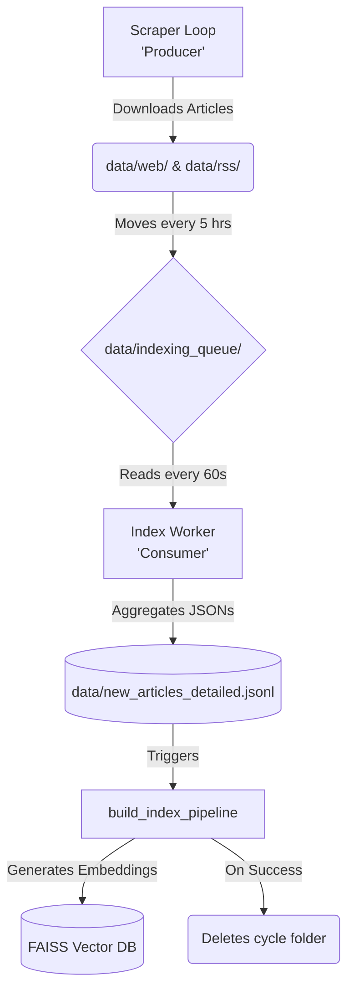

# The Scraper ➡️ FAISS Index Handoff Pipeline

**To the Embeddings & FAISS Engineer:**  
This document serves as your technical guide to understanding the automated data ingestion pipeline. It explains how the web and RSS scrapers work, how the data is seamlessly organized, and the exact point where the system hands control over to your `build_index` machine learning pipeline.

---

## 🏛️ 1. High-Level Architecture Overview

The system operates on a highly decoupled **Producer-Consumer model**. This ensures that the time-consuming process of web scraping and the CPU/GPU-heavy process of generating vector embeddings never block or overlap each other.



---

## ⏱️ 2. The Producer: 5-Hour Scraper Cycles (`scheduler.py`)

When the user runs `python main.py` and selects the `Continuous Pipeline`, a background task called the **Crawler Loop** starts.

1. **Concurrent Scraping:** The system spins up exactly 39 asynchronous tasks, actively scraping our approved Indian and International web & RSS sources.
2. **The 5-Hour Limit:** To prevent memory bloat and to force periodic indexing, the scraper operates under a strict timeout (configurable via `CRAWLER_CYCLE_INTERVAL_MINUTES` in the `.env` file, default is 300 minutes/5 hours).
3. **The Handoff:** Once the cycle completes or times out:
   - The system takes every newly created article file located in `data/web` and `data/rss`.
   - It **moves** them entirely into a new folder named with the cycle number and a timestamp, for example: `data/indexing_queue/cycle_1_20260329_142758/`.
   - It then immediately wipes its hands clean and restarts Cycle 2 from zero.

> [!NOTE] 
> Because the `data/web` and `data/rss` folders are emptied instantly, the scraper begins scraping again without ever waiting for your FAISS model to finish building!

---

## 📥 3. The Consumer: The Background Index Worker 

Running at the exact same time as the scraper is a background daemon called the **Index Worker** (also inside `scheduler.py`).

The Index Worker wakes up every 60 seconds and checks the `data/indexing_queue/` directory. If it spots a dropped-off cycle folder from the scraper, it initiates a 3-step sequence:

### Step A: Consolidation into Master JSONL
Your `build_index` logic relies on reading a single, massive JSON Lines file containing all articles ever discovered.
The Index Worker accommodates this by diving into the `cycle_X` folder, extracting every single JSON object it finds inside the `web` and `rss` subdirectories, and **appending** them line-by-line to your master file:
👉 `data/new_articles_detailed.jsonl`

### Step B: The AI Trigger (Your Domain)
The moment the `jsonl` file has been fully appended with the newest articles from the last 5 hours, the Index Worker automatically executes your exact entrypoint perfectly:

```python
from app.embeddings.build_index import build_index_pipeline
await build_index_pipeline()
```

When this line runs, your `build_index_pipeline()` takes over:
1. It reads the updated `new_articles_detailed.jsonl`.
2. It breaks the data into text chunks.
3. It uses your hashing logic to skip building embeddings for old articles it already knows about.
4. It calls out to `langchain_ollama` and FAISS to generate the vectors strictly for the newly appended articles.
5. It overwrites and saves the final `articles.index` database.

### Step C: Infinite Cleanup
If your pipeline succeeds and returns without throwing fatal crashes, the Index Worker concludes the process by running `shutil.rmtree()` on the original `cycle_X` temporary folder. The raw JSON files are deleted from the hard drive since the information is now safely archived inside your FAISS database and the master JSONL file. 

If there is a second cycle folder waiting in the queue, it moves perfectly onto the next one!

---

## 🛡️ 4. Failsafes and Missing Modules

If your code (`build_index.py` or `.faiss`) has missing Pip dependencies (like `langchain_ollama` or `faiss`), the entire application **will not crash**. 

The Index Worker wraps your module inside a secure `try...except ImportError` block. 
- If your system fails to import missing packages, the Index Worker will log an explicit error in the console.
- **The Cycle Folder is NOT deleted.** It is safely left in the `indexing_queue/` folder until the dependency issues are fixed.
- It will wait 60 seconds and try to trigger your pipeline again, ensuring zero data loss while you debug your AI code!

---

## 📂 5. Directory Mapping Summary

You don't need to change any paths in your code. The system is designed automatically to feed your existing logic perfectly.

```text
Source-Bias-Analyzer/
│
├── .env                              <-- Controls scraper cycle duration
├── data/
│   ├── new_articles_detailed.jsonl  <--- THE SOURCE OF TRUTH: Your index builder reads this!
│   │
│   ├── web/                         <--- Temporary pipeline workspace
│   ├── rss/                         <--- Temporary pipeline workspace
│   │
│   └── indexing_queue/              <--- The Staging Handoff Zone
│       └── cycle_1_20260329_142758/ <--- Handled securely by the worker (Deleted after FAISS index)
│
└── app/
    ├── main.py                      <--- Press 1: Starts everything automatically
    ├── input/                       
    │   └── news_pipeline/
    │       └── scheduler.py         <--- The Brains: Controls the loops and triggers you
    └── embeddings/                  
        └── build_index.py           <--- YOUR BUILDER: Triggered completely automatically!
```
