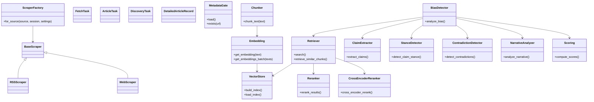
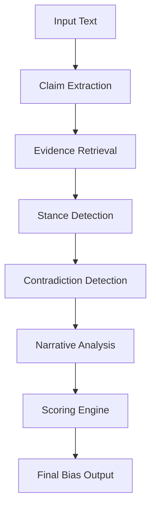
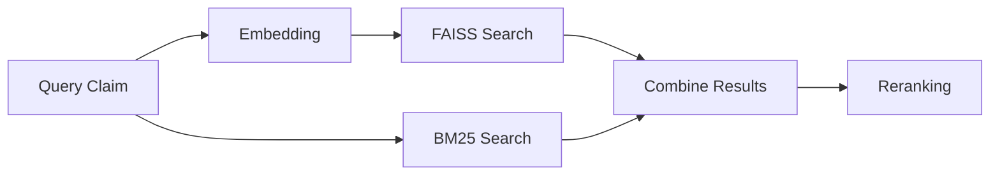
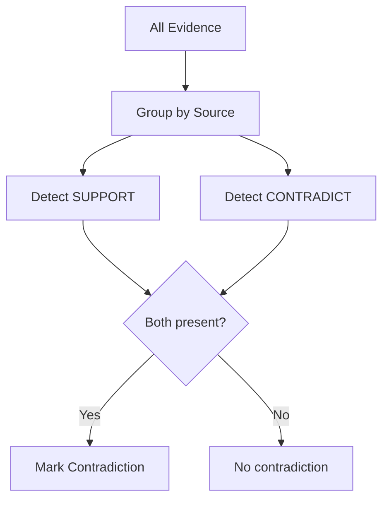
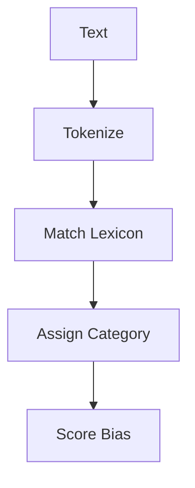
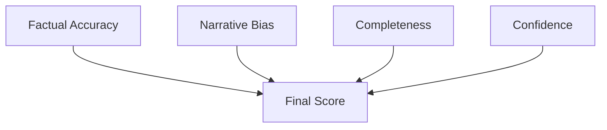
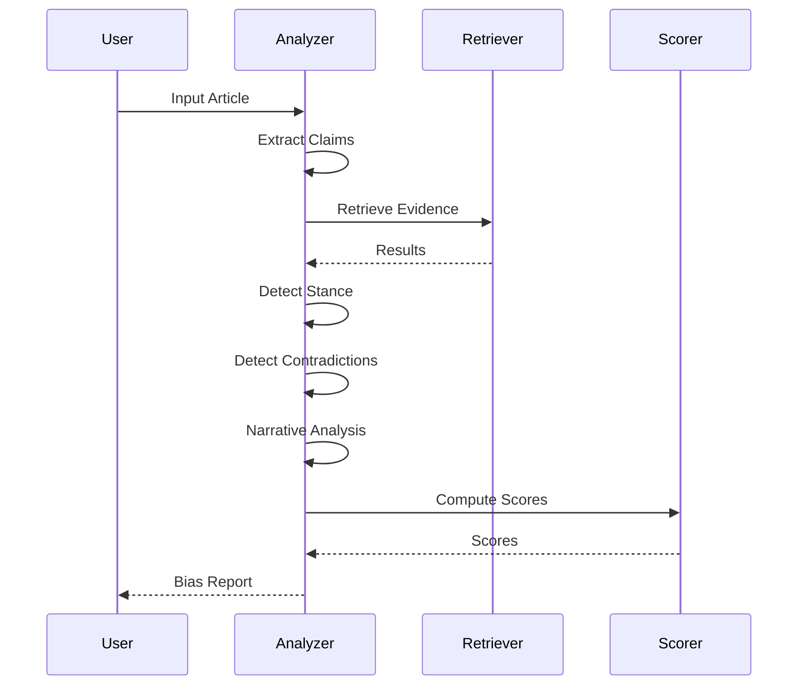

# Bias Analysis Pipeline — Architecture & Explanation

## Overview
This project implements a multi-stage AI pipeline to analyze bias in news articles.

---

## 1. System Architecture (Class Diagram)

---

## 2. Pipeline Flow

---

## 3. Retrieval System

---

## 4. Contradiction Detection

---

## 5. Narrative Analysis

---

## 6. Scoring System

---

## 7. Execution Flow

---

## Summary

This pipeline integrates NLP, retrieval systems, and reasoning to detect bias in articles.
