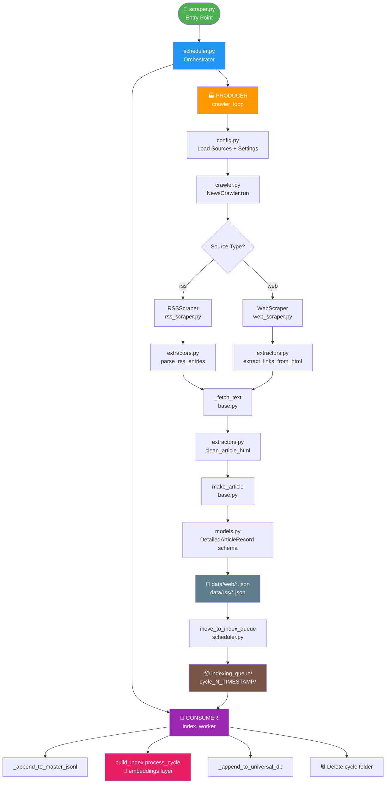
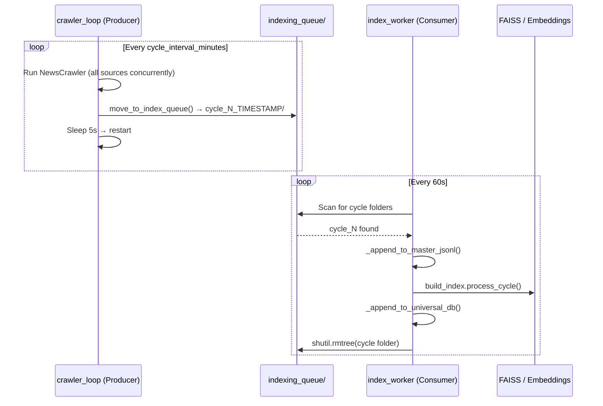

# 🗞️ `input/` — Data Ingestion Layer: Complete Pipeline Overview

> **Directory:** `app/input/`
> **Role:** Fetches, cleans, deduplicates, and queues news articles from 30+ sources for downstream embedding & FAISS indexing.

---

## 📁 Directory Structure

```
input/
├── loader.py                  ← Stub: reads article text for bias test
├── scraper.py                 ← Entry point (calls scheduler.main)
│
├── data/                      ← 🟡 Scraper workspace (ephemeral)
│   ├── web/                   ← Live JSON files per web source
│   │   ├── bbc_news.json
│   │   └── the_guardian.json
│   ├── rss/                   ← Live JSON files per RSS source
│   │   ├── bbc_rss.json
│   │   └── guardian_rss.json
│   └── indexing_queue/        ← Completed cycles waiting for FAISS
│       └── cycle_N_YYYYMMDD_HHMMSS/
│           ├── web/
│           └── rss/
│
└── news_pipeline/             ← Core scraper + scheduler code
    ├── config.py              ← Settings, paths, source registry
    ├── crawler.py             ← Async task runner
    ├── scheduler.py           ← Producer + Consumer loops
    ├── metadata_gate.py       ← Global URL dedup gate
    ├── models.py              ← Article schema (dataclasses)
    ├── extractors.py          ← HTML → clean text
    ├── queue_embedder.py      ← [RETIRED] raw .npy embedder
    ├── test_classifier.py     ← URL allow/block classifier
    └── scrapers/
        ├── __init__.py        ← ScraperFactory
        ├── base.py            ← BaseScraper + JSON I/O
        ├── web_scraper.py     ← BFS web crawler
        └── rss_scraper.py     ← RSS feed parser
```

---

## 🔄 High-Level Pipeline Flow



---

## 🔁 Producer–Consumer Model

The scheduler runs **two concurrent async loops**:

| Role | Loop | Responsibility |
|------|------|----------------|
| 🏭 **Producer** | `crawler_loop()` | Runs scrapers for N minutes, then moves data to `indexing_queue/` |
| 🧠 **Consumer** | `index_worker()` | Watches queue, embeds + indexes each cycle, then deletes it |



---

## 🧩 Component Responsibilities (Quick Reference)

| File | What it does | Cross-link |
|------|-------------|-----------|
| `loader.py` | Reads pasted article text (bias test stub) | [loader.md](loader.md) |
| `scraper.py` | CLI entry point | [scraper.md](scraper.md) |
| `config.py` | All env vars, 30+ source definitions, path config | [config.md](config.md) |
| `crawler.py` | One async task per source, shared semaphore | [crawler.md](crawler.md) |
| `scheduler.py` | Producer + Consumer orchestration | [scheduler.md](scheduler.md) |
| `metadata_gate.py` | Read-only global URL dedup | [metadata_gate.md](metadata_gate.md) |
| `models.py` | `DetailedArticleRecord`, `ArticleTask`, etc. | [models.md](models.md) |
| `extractors.py` | HTML cleaning, RSS parsing, tag generation | [extractors.md](extractors.md) |
| `queue_embedder.py` | ⚠️ Retired raw `.npy` embedding helper | [queue_embedder.md](queue_embedder.md) |
| `test_classifier.py` | URL article/non-article scorer | [test_classifier.md](test_classifier.md) |
| `scrapers/__init__.py` | `ScraperFactory` routing | [scrapers_init.md](scrapers_init.md) |
| `scrapers/base.py` | `BaseScraper` + JSON I/O helpers | [base.md](base.md) |
| `scrapers/web_scraper.py` | Infinite BFS crawler | [web_scraper.md](web_scraper.md) |
| `scrapers/rss_scraper.py` | RSS feed fetcher + article extractor | [rss_scraper.md](rss_scraper.md) |

---

## 📦 Article JSON Schema

Every saved article follows the `DetailedArticleRecord` schema from [`models.py`](models.md):

```json
{
  "id":           "md5(url)",
  "url":          "https://...",
  "title":        "Article Headline",
  "text":         "Full extracted body text...",
  "hash":         "md5(text)",
  "source":       "bbc_rss",
  "category":     "world",
  "published_at": "2024-03-15T10:30:00",
  "scraped_at":   "2024-03-15T11:00:00Z",
  "language":     "en",
  "tags":         ["politics", "uk", "election"],
  "summary":      "First 3 sentences of the article..."
}
```

---

## 🌐 Source Categories

| Category | Example Sources |
|----------|----------------|
| `india` | Times of India, The Hindu, India Today, Hindustan Times |
| `world` | BBC, Reuters, Al Jazeera, The Guardian, AP |
| `technology` | TechCrunch, Ars Technica, The Verge, Wired, Engadget |
| `ai` | MIT AI News, AI News RSS |
| `science` | Nature, ScienceDaily, Space.com |
| `business` | CNBC, Livemint |
| `aggregator` | Google News (World, India, Tech, Science) |

---

## ⚙️ Key Environment Variables

| Variable | Default | Purpose |
|----------|---------|---------|
| `CRAWLER_GLOBAL_WORKERS` | `30` | Max concurrent HTTP requests |
| `CRAWLER_PER_DOMAIN_CONCURRENCY` | `3` | Per-domain rate limiting |
| `CRAWLER_CYCLE_INTERVAL_MINUTES` | `120` | How long each scrape cycle runs |
| `CRAWLER_REQUEST_TIMEOUT_SEC` | `30` | HTTP timeout per request |
| `OUTPUT_BASE_PATH` | `app/input/data` | Where JSON files are written |
| `MAIN_METADATA_PATH` | `data/main_metadata.json` | Global URL dedup file |

---

## 🔗 Related Layers

- **Embeddings Layer** → `app/embeddings/` — consumes `indexing_queue/` cycle folders
- **FAISS Index** → `app/embeddings/build_index.py` — called by `index_worker`
- **Universal DB** → `data/web/`, `data/rss/` — permanent article archive
