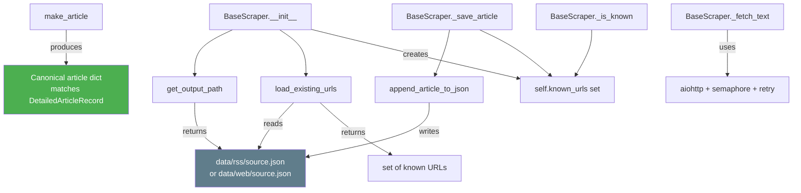
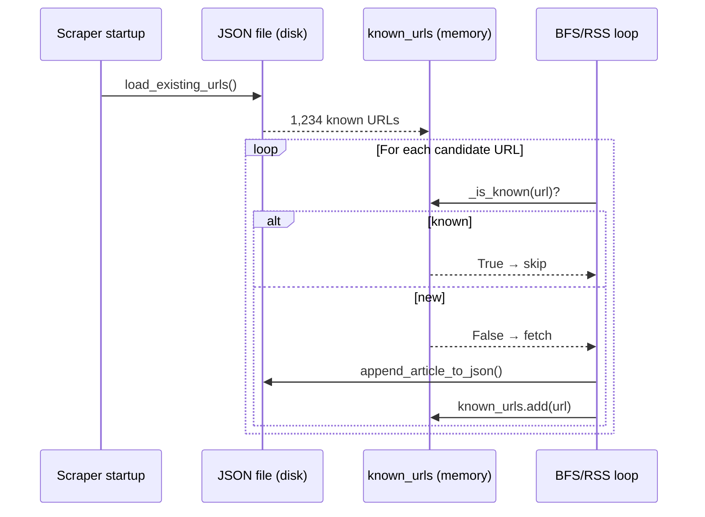

# 🧱 `base.py` — BaseScraper, JSON I/O & Article Schema

> **Path:** `app/input/news_pipeline/scrapers/base.py`
> **Role:** Abstract base class for all scrapers, plus shared JSON I/O helpers and the `make_article()` canonical article factory function.
> **Subclassed by:** [`rss_scraper.py`](rss_scraper.md), [`web_scraper.py`](web_scraper.md)

---

## 📌 Overview

`base.py` provides three things:

| Component | What it is |
|-----------|-----------|
| `make_article()` | Factory function → canonical article dict |
| JSON I/O helpers | `get_output_path`, `load_existing_urls`, `append_article_to_json` |
| `BaseScraper` | Abstract class with shared HTTP fetching, dedup, and save logic |

---

## 🗂️ Module Structure



---

## 📖 Function Reference

### `make_article(...) → dict`

Produces the **canonical article dict** for storage:

```python
def make_article(
    *,
    url: str,
    title: str,
    text: str,
    summary: str,
    tags: list[str],
    source: str,
    category: str,
    published_at: str | None,
    language: str = "en",
) -> dict
```

Generated fields:

| Field | Source |
|-------|--------|
| `id` | `md5(url)` |
| `hash` | `md5(text)` — for change detection |
| `scraped_at` | `datetime.now(UTC).isoformat()` |
| `published_at` | Provided, or falls back to `scraped_at` |

---

### `get_output_path(output_base, source_type, source_name) → Path`

Routes output by source type:
- `rss` → `output_base/rss/source_name.json`
- `web` → `output_base/web/source_name.json`

Creates parent directories automatically.

---

### `load_existing_urls(json_path) → set[str]`

Reads an existing JSON file and returns all `"url"` values as a set. Used at scraper startup to populate `known_urls` — ensuring dedup works even if the scraper is restarted mid-run.

---

### `append_article_to_json(json_path, article) → None`

Appends one article to its source JSON file (read → append → write):

```
Before: [article1, article2]
After:  [article1, article2, article3]
```

> ⚠️ This is a full read-write cycle per article. For high-volume sources, this could be a bottleneck. The in-memory `known_urls` set ensures we never write duplicates.

---

## 📖 BaseScraper Class Reference

### `__init__(source, session, settings, semaphore)`

```python
self.source      = source           # Source dataclass (name, url, type, category)
self.session     = session          # Shared aiohttp.ClientSession
self.settings    = settings         # CrawlSettings
self.semaphore   = semaphore        # Shared asyncio.Semaphore(30)
self.json_path   = get_output_path(...)
self.known_urls  = load_existing_urls(self.json_path)
```

`known_urls` is loaded from disk at startup → dedup works across restarts.

---

### Abstract: `async scrape() → None`

Must be implemented by subclasses. Called by [`crawler.py`](crawler.md).

---

### `_is_known(url: str) → bool`

`O(1)` lookup in `self.known_urls`. Called before every fetch.

---

### `_save_article(article: dict) → None`

**Thread-safe** (within async context) save sequence:


The `known_urls.add()` happens **before** the file write — so if two concurrent tasks find the same article simultaneously, only one will proceed past the race guard.

---

### `async _fetch_text(url: str) → tuple[str, str]`

Fetches a URL with retry + exponential backoff:

```python
for attempt in range(max_retries):
    async with semaphore:
        try:
            resp = await session.get(url, headers={User-Agent})
            return await resp.text(), str(resp.url)
        except:
            await asyncio.sleep(backoff_base * 2^attempt)
return "", url   # all retries failed
```

| Feature | Detail |
|---------|--------|
| **Semaphore** | Shared across all scrapers — limits total concurrent requests |
| **Retries** | Default 3 attempts |
| **Backoff** | `1.5s → 3.0s → 6.0s` (base=1.5, exponential) |
| **Final URL** | Returns `str(resp.url)` — captures redirects |
| **Failure** | Returns `("", url)` — callers check for empty string |

---

## 🔄 Dedup Lifecycle



---

## 💡 Article Output Example

```python
article = make_article(
    url="https://www.bbc.com/news/world-68432187",
    title="UK Election Results Declared",
    text="The Labour Party has won...",
    summary="The Labour Party has won the UK general election...",
    tags=["election", "labour", "uk"],
    source="bbc_rss",
    category="world",
    published_at="2024-07-05T02:15:00",
)

# Result:
{
    "id":           "9a8f3d2e...",
    "url":          "https://www.bbc.com/news/world-68432187",
    "title":        "UK Election Results Declared",
    "text":         "The Labour Party has won...",
    "hash":         "7f3d2a1b...",
    "source":       "bbc_rss",
    "category":     "world",
    "published_at": "2024-07-05T02:15:00",
    "scraped_at":   "2024-07-05T03:00:00.000000+00:00",
    "language":     "en",
    "tags":         ["election", "labour", "uk"],
    "summary":      "The Labour Party has won the UK general election..."
}
```

---

## 🔗 Cross-References

| Reference | Reason |
|-----------|--------|
| [`rss_scraper.py`](rss_scraper.md) | Extends `BaseScraper` |
| [`web_scraper.py`](web_scraper.md) | Extends `BaseScraper` |
| [`scrapers/__init__.py`](scrapers_init.md) | `ScraperFactory` instantiates subclasses |
| [`models.py`](models.md) | `DetailedArticleRecord` — same schema as `make_article()` output |
| [`extractors.py`](extractors.md) | Produces `content`, `tags`, `summary` fed into `make_article()` |
| [`config.py`](config.md) | `CrawlSettings` and `Source` used in `__init__` |
| [`OVERVIEW.md`](OVERVIEW.md) | Full pipeline context |
