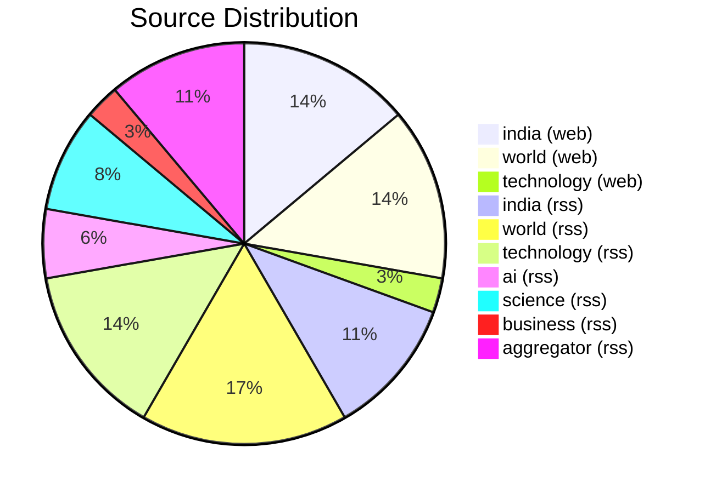
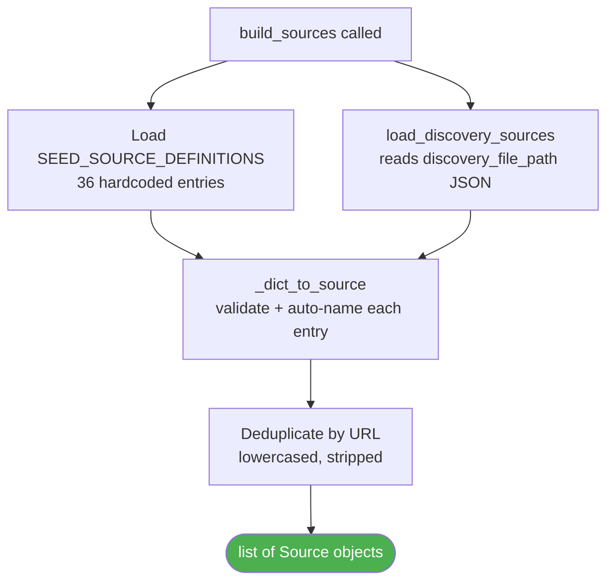

# ⚙️ `config.py` — Settings, Sources & Path Configuration

> **Path:** `app/input/news_pipeline/config.py`
> **Role:** Single source of truth for all crawler settings, output paths, and the registry of 30+ news sources.
> **Loaded by:** [`crawler.py`](crawler.md), [`scheduler.py`](scheduler.md), [`base.py`](base.md)

---

## 📌 Overview

`config.py` provides two frozen dataclasses and three public functions:

| Symbol | Type | Purpose |
|--------|------|---------|
| `Source` | `@dataclass(frozen)` | Describes one news source (name, url, type, category) |
| `CrawlSettings` | `@dataclass(frozen)` | All crawler tuning parameters and file paths |
| `build_sources()` | function | Merges seed sources + discovery file, deduplicates by URL |
| `load_settings()` | function | Reads env vars → returns a `CrawlSettings` instance |
| `load_discovery_sources()` | function | Reads an optional JSON file of extra sources at runtime |

---

## 🗂️ Dataclass Reference

### `Source`

```python
@dataclass(frozen=True, slots=True)
class Source:
    name: str          # "bbc_rss"
    url: str           # "https://feeds.bbci.co.uk/news/rss.xml"
    source_type: str   # "rss" | "web"
    category: str      # "world" | "india" | "technology" | ...
```

### `CrawlSettings`

```python
@dataclass(frozen=True, slots=True)
class CrawlSettings:
    global_workers: int              # Max concurrent HTTP requests (default: 30)
    per_domain_concurrency: int      # Per-domain cap (default: 3)
    request_timeout_sec: int         # HTTP timeout (default: 30s)
    max_retries: int                 # Retry count on failure (default: 3)
    backoff_base_sec: float          # Exponential backoff base (default: 1.5s)
    cycle_interval_minutes: int      # Scrape cycle length (default: 120min)
    output_base_path: Path           # data/ root for JSON files
    output_failed_jsonl_path: Path   # Failed articles log
    metadata_main_path: Path         # Global dedup metadata JSON
    discovery_file_path: Path        # Runtime extra sources JSON
    verbose_progress: bool           # Print progress (default: true)
    progress_interval_sec: int       # Progress print interval (default: 5s)
    insecure_ssl_fallback: bool      # Skip TLS verify (default: false)
    user_agent: str                  # Browser UA string
```

---

## 🌐 Seed Source Registry

`SEED_SOURCE_DEFINITIONS` holds **36 active sources** across 7 categories:



### Category Breakdown

| Category | Sources |
|----------|---------|
| `india` | Times of India, The Hindu (web+rss), India Today (web+rss), Hindustan Times, Indian Express, Firstpost, Livemint |
| `world` | BBC (web+rss), Reuters (web+rss), Al Jazeera (web+rss), The Guardian (web+rss), AP (web+rss), NPR |
| `technology` | TechCrunch (web+rss), Ars Technica, The Verge, Wired, Engadget |
| `ai` | MIT AI News, AI News RSS |
| `science` | Nature, ScienceDaily, Space.com |
| `business` | CNBC, Livemint |
| `aggregator` | Google News (World, India, Tech, Science) |

---

## 🔄 Source Loading Flow



### Auto-naming Logic

If a source has no `name`, config auto-generates one from the URL:

```python
# URL: "https://feeds.bbci.co.uk/news/rss.xml"
# → netloc: "feeds_bbci_co_uk"
# → path:   "news_rss_xml"
# → name:   "feeds_bbci_co_uk_news_rss_xml"
```

---

## ⚙️ Environment Variables

All settings are overridable via `.env` (auto-discovered via `python-dotenv`):

| Variable | Default | Description |
|----------|---------|-------------|
| `CRAWLER_GLOBAL_WORKERS` | `30` | Semaphore size for total HTTP concurrency |
| `CRAWLER_PER_DOMAIN_CONCURRENCY` | `3` | (Referenced in config, enforced in scrapers) |
| `CRAWLER_REQUEST_TIMEOUT_SEC` | `30` | `aiohttp.ClientTimeout` total |
| `CRAWLER_MAX_RETRIES` | `3` | Retry attempts with exponential backoff |
| `CRAWLER_BACKOFF_BASE_SEC` | `1.5` | `sleep(base * 2^attempt)` |
| `CRAWLER_CYCLE_INTERVAL_MINUTES` | `120` | Hard timeout per scrape cycle |
| `OUTPUT_BASE_PATH` | `app/input/data` | Root for `web/` and `rss/` JSON folders |
| `OUTPUT_FAILED_JSONL_PATH` | `data/failed_articles.jsonl` | Failed fetch log |
| `MAIN_METADATA_PATH` | `data/main_metadata.json` | Global URL dedup file |
| `DISCOVERY_FILE_PATH` | `data/discovery_sources.json` | Runtime extra sources |
| `CRAWLER_VERBOSE_PROGRESS` | `true` | Enables `✅ [SAVED]` console output |
| `CRAWLER_PROGRESS_INTERVAL_SEC` | `5` | Progress log frequency |
| `CRAWLER_INSECURE_SSL_FALLBACK` | `false` | Disable TLS verification |
| `CRAWLER_USER_AGENT` | Chrome 123 UA | Sent with every HTTP request |

---

## 💡 Adding a New Source

Just append one dict to `SEED_SOURCE_DEFINITIONS` — nothing else needed:

```python
# RSS example:
{"name": "my_feed", "url": "https://example.com/feed.xml", "source_type": "rss", "category": "technology"},

# Web (BFS) example:
{"name": "my_site", "url": "https://example.com/news/", "source_type": "web", "category": "world"},
```

Or add it to `data/discovery_sources.json` at runtime:
```json
{
  "sources": [
    {"name": "new_source", "url": "https://...", "source_type": "rss", "category": "india"}
  ]
}
```

---

## 🔗 Cross-References

| Reference | Reason |
|-----------|--------|
| [`crawler.py`](crawler.md) | Calls `build_sources()` and `load_settings()` |
| [`scheduler.py`](scheduler.md) | Calls `load_settings()` |
| [`base.py`](base.md) | Uses `CrawlSettings` fields for HTTP config |
| [`scrapers/__init__.py`](scrapers_init.md) | Uses `Source` and `CrawlSettings` types |
| [`OVERVIEW.md`](OVERVIEW.md) | Full pipeline context |
