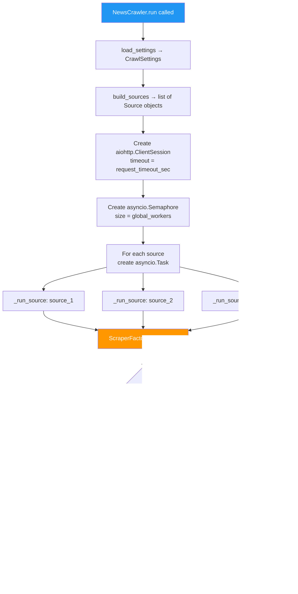
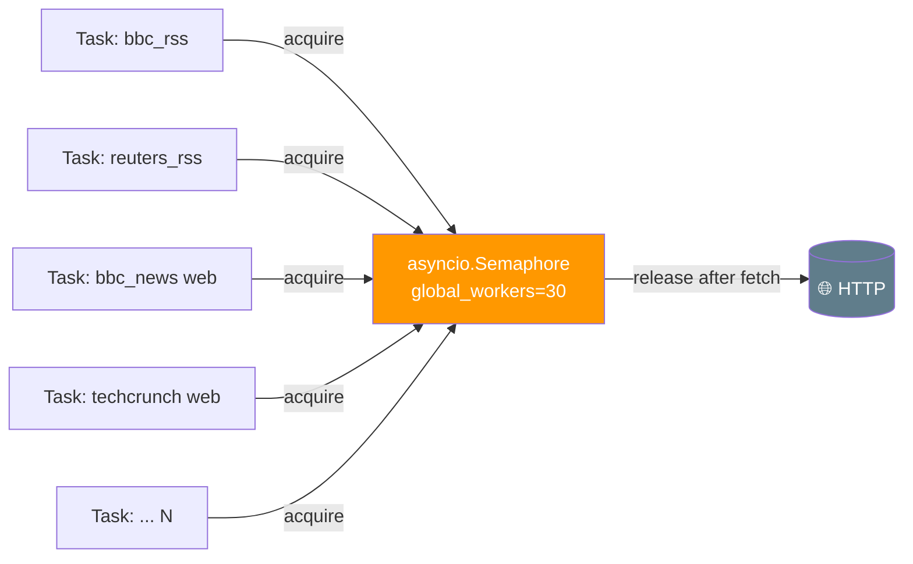

# 🕷️ `crawler.py` — Async Task Runner

> **Path:** `app/input/news_pipeline/crawler.py`
> **Role:** Spawns one async task per news source and runs them all concurrently under a shared semaphore.
> **Called by:** [`scheduler.py`](scheduler.md) → `crawler_loop()`

---

## 📌 Overview

`crawler.py` defines `NewsCrawler` — the **concurrency manager** of the pipeline. It:

1. Loads all sources from [`config.py`](config.md)
2. Creates a **shared `asyncio.Semaphore`** to limit global HTTP concurrency
3. Opens a single **shared `aiohttp.ClientSession`** for all scrapers
4. Spawns **one `asyncio.Task` per source** and runs them all with `asyncio.gather()`
5. Reports any crashes after all tasks complete

It does **not** do any scraping itself — it delegates to [`ScraperFactory`](scrapers_init.md).

---

## 🔄 Execution Flow



---

## 📖 Class & Method Reference

### `NewsCrawler`

```python
class NewsCrawler:
    def __init__(self, settings: CrawlSettings | None = None)
    async def run(self) -> None
    async def _run_source(source, session, semaphore) -> None
    def _build_logger(self) -> logging.Logger
```

---

### `async run() → None`

The **main entry point**. Called by `scheduler.py`'s `crawler_loop()`.

| Step | What happens |
|------|-------------|
| 1 | `build_sources()` → all `Source` objects from config + discovery file |
| 2 | Print startup banner with source counts |
| 3 | Open `aiohttp.ClientSession` with configured timeout |
| 4 | Create `asyncio.Semaphore(global_workers)` |
| 5 | For each source → `asyncio.create_task(_run_source(...))` |
| 6 | `await asyncio.gather(*tasks, return_exceptions=True)` |
| 7 | Log any `Exception` results from failed scrapers |

---

### `async _run_source(source, session, semaphore) → None`

Per-source wrapper. Creates the appropriate scraper and calls `.scrape()`.

```python
async def _run_source(self, source, session, semaphore):
    scraper = ScraperFactory.for_source(
        source=source,
        session=session,
        settings=self.settings,
        semaphore=semaphore,
    )
    await scraper.scrape()
```

If `scraper.scrape()` raises, the exception is caught and logged — **it does not crash other scrapers**.

---

## 🔒 Concurrency Model



- All scrapers share **one semaphore** → at most `global_workers=30` HTTP requests are in-flight at any moment
- Each task is independent — a slow or failing source doesn't block others
- `asyncio.gather(return_exceptions=True)` ensures all tasks complete even if some crash

---

## 💡 Example Console Output

```
======================================================================
🚀 NEWS CRAWLER STARTING
   Total sources: 36 (6 web + 30 rss)
   Concurrency:   30 workers
   Output:        app/input/data/
======================================================================

  📡 [RSS START] bbc_rss
  🌐 [WEB BFS START] bbc_news
  📡 [RSS START] reuters_rss
  ...
  ✅ [SAVED]    bbc_rss             | "UK election results declared..."
  ...
======================================================================
🏁 ALL SCRAPERS FINISHED
======================================================================
```

---

## 🔗 Cross-References

| Reference | Reason |
|-----------|--------|
| [`scheduler.py`](scheduler.md) | Creates `NewsCrawler` and calls `.run()` |
| [`config.py`](config.md) | `build_sources()` and `load_settings()` |
| [`scrapers/__init__.py`](scrapers_init.md) | `ScraperFactory.for_source()` |
| [`web_scraper.py`](web_scraper.md) | Handles `source_type="web"` |
| [`rss_scraper.py`](rss_scraper.md) | Handles `source_type="rss"` |
| [`base.py`](base.md) | Shared semaphore used by `_fetch_text()` |
| [`OVERVIEW.md`](OVERVIEW.md) | Full pipeline context |
