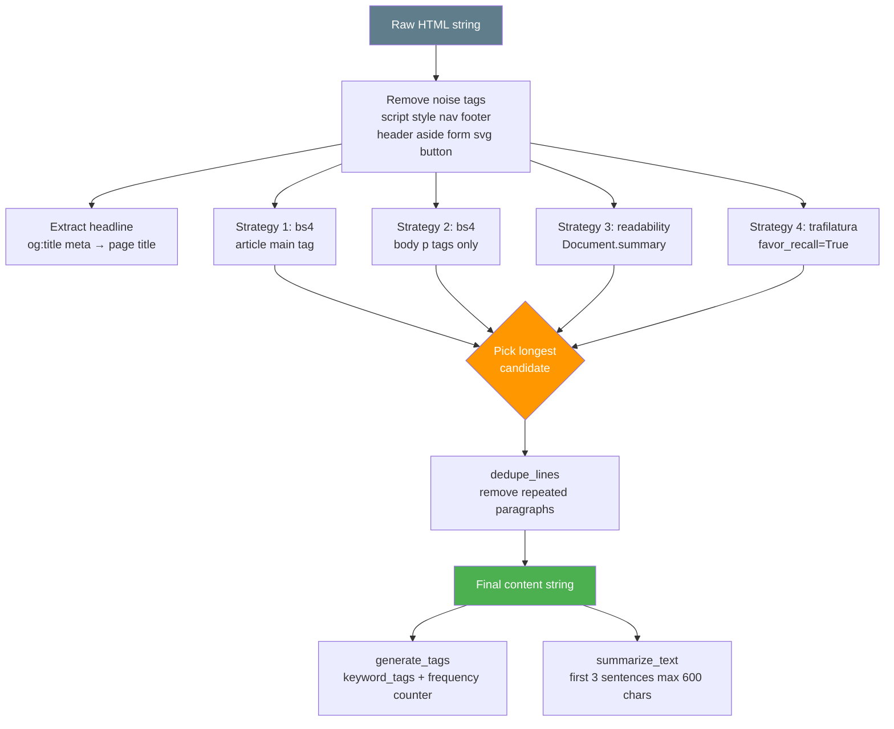

# 🔬 `extractors.py` — HTML Cleaning, RSS Parsing & Text Extraction

> **Path:** `app/input/news_pipeline/extractors.py`
> **Role:** All text extraction, URL normalization, HTML cleaning, RSS parsing, tag generation, and summarization logic.
> **Used by:** [`rss_scraper.py`](rss_scraper.md), [`web_scraper.py`](web_scraper.md), [`metadata_gate.py`](metadata_gate.md)

---

## 📌 Overview

`extractors.py` is the **content processing core** of the pipeline. It converts raw HTTP responses (HTML pages, RSS XML) into clean, structured text ready for storage.

Key capabilities:
- URL canonicalization (strip UTM params, normalize path)
- RSS feed parsing via `feedparser`
- Multi-strategy HTML article extraction (BeautifulSoup + readability + trafilatura)
- Text summarization and keyword tag generation

---

## 🔄 HTML Extraction Pipeline



The extractor uses **four strategies** and picks the **longest result** — this maximizes article content recovery across different site structures.

---

## 📖 Function Reference

### `canonicalize_url(raw_url, base_url=None) → str`

Normalizes a URL for consistent deduplication:

| Step | Example |
|------|---------|
| Resolve relative URLs | `/news/article` + `https://bbc.com` → `https://bbc.com/news/article` |
| Lowercase netloc | `BBC.COM` → `bbc.com` |
| Collapse double slashes | `//news//` → `/news/` |
| Strip trailing slash | `/news/` → `/news` |
| Remove tracking params | `?utm_source=twitter&id=123` → `?id=123` |
| Sort remaining params | `?b=2&a=1` → `?a=1&b=2` |
| Strip fragment | `#section` removed |

Removed tracking params: `utm_*`, `gclid`, `fbclid`, `ocid`, `cmpid`

---

### `is_relevant_http_url(url) → bool`

Quick guard — rejects `mailto:`, `tel:`, `javascript:` URLs. Accepts only `http://` and `https://`.

---

### `is_probable_article_url(url) → bool`

Heuristic filter for article-like URLs. Returns `True` if:
- URL contains article tokens: `/news/`, `/article/`, `/articles/`, `/latest`, `/story`, `/world/`, `/india/`
- OR URL has a date pattern: `/2024/03/15/`

Rejects media files: `.jpg`, `.png`, `.pdf`, `.mp4`, `.js`, `.css`, etc.

---

### `parse_datetime_to_iso(raw_value) → str | None`

Handles all `feedparser` date formats:
- Python `datetime` objects → `.isoformat()`
- ISO/RFC date strings → `dateutil.parser.parse()`
- `time.struct_time` (feedparser's `published_parsed`) → `datetime(*value[:6])`

---

### `extract_links_from_html(html, base_url) → list[tuple[str, str]]`

Extracts all `<a href>` links from a page:
1. Parses with BeautifulSoup
2. Canonicalizes each href (resolved against `base_url`)
3. Filters non-HTTP and duplicate URLs
4. Returns `[(canonical_url, link_text), ...]`

Used by [`web_scraper.py`](web_scraper.md) for BFS link discovery.

---

### `parse_rss_entries(feed_text) → list[dict]`

Parses RSS/Atom XML via `feedparser`:

```python
# Returns list of:
{
    "url": "https://www.bbc.com/news/...",  # canonicalized
    "title": "Article Title",               # normalized whitespace
    "published_at": "2024-03-15T10:30:00"  # ISO string or None
}
```

Tries multiple date fields: `published`, `updated`, `published_parsed`, `updated_parsed`.

---

### `clean_article_html(html, base_url) → dict`

Main extraction function. Returns:

```python
{
    "headline": str,           # og:title or page <title>
    "content": str,            # Best extracted body text
    "links": list[tuple],      # (url, text) pairs for BFS
    "keyword_tags": list[str], # From <meta name="keywords">
    "extraction_method": str,  # "trafilatura" | "readability" | "bs4_article_main" | ...
}
```

#### Extraction Strategy Priority

| Strategy | Method | Chosen when |
|----------|--------|-------------|
| `bs4_article_main` | `<article>` or `<main>` tag | Always tried |
| `bs4_body_paragraphs` | All `<p>` tags in body | Always tried |
| `readability` | Mozilla readability port | If `readability` installed |
| `trafilatura` | ML-based extractor | If `trafilatura` installed |

Winner = **longest text** across all strategies.

---

### `summarize_text(text, max_sentences=3, max_chars=600) → str`

Splits on sentence-ending punctuation (`[.!?]\s+`), takes first 3 sentences, truncates to 600 chars.

---

### `generate_tags(headline, content, keyword_tags, max_tags=10) → list[str]`

1. First fills tags from `<meta keywords>` (already extracted)
2. Then tokenizes `headline + content`, removes stop words
3. Picks top N by frequency using `Counter`

```python
# Example:
headline = "India's GDP grows 8.4% in Q3"
content  = "India's economy... India... growth... GDP..."
tags     = ["gdp", "india", "economy", "growth", "q3"]
```

**Stop words** removed: `a`, `an`, `the`, `and`, `or`, `to`, `of`, `in`, `is`, `are`, `was`, `were`, `be`, ... (40+ words)

---

## 🔩 Constants

| Constant | Value | Used for |
|----------|-------|---------|
| `NOISE_TAGS` | `script style noscript nav footer...` | Tags removed before extraction |
| `SKIP_EXTENSIONS` | `.jpg .png .pdf .mp4 .js .css...` | URLs to never crawl |
| `STOP_WORDS` | 40+ common words | Excluded from tag generation |

---

## 💡 Example

```python
from app.input.news_pipeline.extractors import clean_article_html, summarize_text, generate_tags

html = "<html>...<article><p>India's economy expanded...</p></article>...</html>"
result = clean_article_html(html, base_url="https://thehindu.com/news/article123")

print(result["headline"])          # "India's Economy Grows 8.4%"
print(result["extraction_method"]) # "trafilatura"
print(len(result["content"]))      # 3842

summary = summarize_text(result["content"])
tags = generate_tags(result["headline"], result["content"], result["keyword_tags"])
print(tags)  # ["economy", "india", "gdp", "growth", "q3", ...]
```

---

## 🔗 Cross-References

| Reference | Reason |
|-----------|--------|
| [`rss_scraper.py`](rss_scraper.md) | Calls `parse_rss_entries`, `clean_article_html`, `generate_tags`, `summarize_text` |
| [`web_scraper.py`](web_scraper.md) | Calls `extract_links_from_html`, `clean_article_html`, `generate_tags`, `summarize_text` |
| [`metadata_gate.py`](metadata_gate.md) | Calls `canonicalize_url` |
| [`base.py`](base.md) | `make_article()` uses output of extraction functions |
| [`OVERVIEW.md`](OVERVIEW.md) | Full pipeline context |
