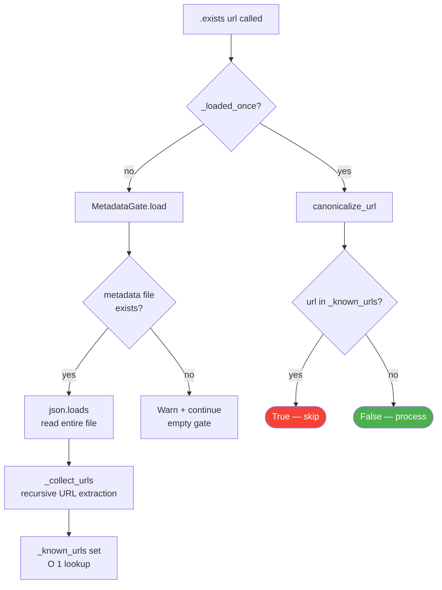
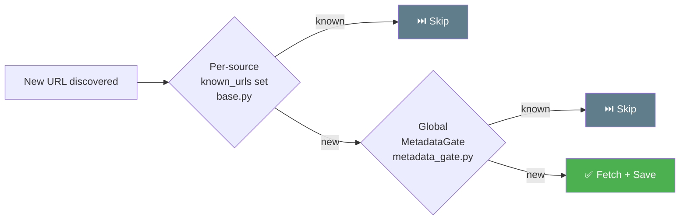

# 🚦 `metadata_gate.py` — Global URL Deduplication Gate

> **Path:** `app/input/news_pipeline/metadata_gate.py`
> **Role:** Read-only URL existence checker backed by a persistent `main_metadata.json` file — prevents re-scraping articles already in the system-wide database.
> **Note:** This is a **global** dedup gate. Per-source dedup is handled separately by `known_urls` sets inside each scraper ([`base.py`](base.md)).

---

## 📌 Overview

`MetadataGate` reads a JSON metadata file at startup and builds an in-memory set of all known article URLs. Any scraper can call `.exists(url)` to check if a URL was **ever** scraped in any previous run — not just the current session.



---

## 📖 Class Reference

### `MetadataGate(metadata_path, logger)`

| Method | Signature | Description |
|--------|-----------|-------------|
| `load()` | `→ None` | Reads metadata file, populates `_known_urls` |
| `exists()` | `(url: str) → bool` | Returns `True` if URL is in the gate |
| `_collect_urls()` | `(node: Any) → None` | Recursively extracts `"url"` fields from any JSON structure |

---

### `load() → None`

- Reads `self._metadata_path` and calls `_collect_urls()` on the parsed JSON
- Sets `_loaded_once = True` after first call
- If file missing: warns + continues with empty gate (non-fatal)
- If file corrupt: logs exception + continues (non-fatal)

---

### `exists(url: str) → bool`

```python
def exists(self, url: str) -> bool:
    if not self._loaded_once:
        self.load()          # lazy initialization on first call
    normalized = canonicalize_url(url)
    return bool(normalized and normalized in self._known_urls)
```

URLs are **canonicalized** before lookup (lowercased, UTM params stripped, trailing slashes removed) — see [`extractors.py`](extractors.md) for `canonicalize_url`.

---

### `_collect_urls(node: Any) → None`

Walks the JSON tree recursively:

```python
# Handles all three JSON shapes:
# 1. Dict with "url" key:
{"url": "https://...", "title": "..."}  → extracts url

# 2. Nested dict:
{"articles": [{"url": "..."}, {"url": "..."}]}  → extracts both

# 3. List of dicts:
[{"url": "..."}, {"url": "..."}]  → extracts all
```

This means `main_metadata.json` can have **any** shape — the gate will find URLs regardless of nesting depth.

---

## 🔄 Dedup Hierarchy

The pipeline has **two layers** of URL deduplication:



| Layer | Scope | Speed | Persistence |
|-------|-------|-------|------------|
| `known_urls` in `BaseScraper` | Per-source, current session | O(1) in-memory | Lost on restart |
| `MetadataGate` | All sources, all time | O(1) in-memory (after load) | Backed by `main_metadata.json` |

---

## 💡 Example

```python
from pathlib import Path
import logging

gate = MetadataGate(
    metadata_path=Path("data/main_metadata.json"),
    logger=logging.getLogger("gate")
)
gate.load()
# → INFO: Metadata gate loaded 142,831 known article URLs

gate.exists("https://www.bbc.com/news/world-12345678")
# → True  (already scraped)

gate.exists("https://www.bbc.com/news/world-99999999")
# → False (new article)
```

---

## ⚠️ Important Notes

- `MetadataGate` is **read-only** — it never writes to `main_metadata.json`
- The gate is loaded **lazily** on first `.exists()` call if `.load()` was not called explicitly
- It does **not** update as new articles are saved during a session — it reflects the state at load time
- The gate is instantiated but its usage is optional — scrapers can function without it (they use `known_urls` instead)

---

## 🔗 Cross-References

| Reference | Reason |
|-----------|--------|
| [`base.py`](base.md) | Per-source `known_urls` set (complementary dedup layer) |
| [`extractors.py`](extractors.md) | `canonicalize_url()` used in `.exists()` |
| [`config.py`](config.md) | `metadata_main_path` setting |
| [`OVERVIEW.md`](OVERVIEW.md) | Full pipeline context |
