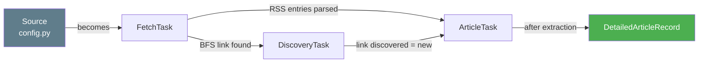

# 📐 `models.py` — Data Schemas (Dataclasses)

> **Path:** `app/input/news_pipeline/models.py`
> **Role:** Defines all data transfer objects (DTOs) used across the pipeline — from task routing to the final saved article record.
> **Used by:** [`base.py`](base.md), [`crawler.py`](crawler.md), [`scheduler.py`](scheduler.md)

---

## 📌 Overview

`models.py` contains **four frozen `@dataclass` types** that describe data flowing through different stages of the pipeline:

| Dataclass | Stage | Purpose |
|-----------|-------|---------|
| `FetchTask` | Planning | Describes what source to fetch |
| `ArticleTask` | Processing | A single article URL to scrape |
| `DiscoveryTask` | BFS crawling | A page to crawl for links |
| `DetailedArticleRecord` | Output | The final saved article |

---

## 🔄 Data Flow Through Models



---

## 📖 Dataclass Reference

### `FetchTask`

Describes one source to be fetched at the start of a scrape cycle.

```python
@dataclass(slots=True)
class FetchTask:
    source_name: str    # "bbc_rss"
    source_url: str     # "https://feeds.bbci.co.uk/news/rss.xml"
    source_type: str    # "rss" | "web"
    category: str       # "world"
```

---

### `ArticleTask`

Represents a single article URL queued for full extraction.

```python
@dataclass(slots=True)
class ArticleTask:
    url: str                         # Canonical article URL
    source_name: str                 # "bbc_rss"
    source_type: str                 # "rss" | "web"
    category: str                    # "world"
    title_hint: str | None = None    # Pre-known title (from RSS feed)
    published_at: str | None = None  # Pre-known date (from RSS feed)
    depth: int = 0                   # BFS depth level
    discovered_from: str | None = None  # Parent URL
    _prefetched: dict | None = None  # Pre-fetched HTML (optional optimization)
```

---

### `DiscoveryTask`

A page to visit for link extraction (BFS traversal).

```python
@dataclass(slots=True)
class DiscoveryTask:
    url: str               # Page to crawl
    source_name: str       # "bbc_news"
    category: str          # "world"
    depth: int             # Current BFS depth
    parent_url: str | None = None  # Where this link was found
```

---

### `DetailedArticleRecord`

The **canonical output schema** — every saved article must match this shape.

```python
@dataclass(slots=True)
class DetailedArticleRecord:
    id: str               # md5(url)
    url: str              # Canonical article URL
    title: str            # Extracted or RSS-provided headline
    text: str             # Full cleaned body text
    hash: str             # md5(text) — for change detection
    source: str           # "bbc_rss" | "bbc_news"
    published_at: str | None  # ISO 8601 datetime or None
    language: str         # "en"
    tags: list[str]       # Generated keyword tags
    summary: str          # First 3 sentences, max 600 chars

    def to_dict(self) -> dict[str, object]: ...
```

#### `to_dict()` Output

```json
{
  "id":           "9a8f3d2e1b4c5f6a...",
  "url":          "https://www.bbc.com/news/world-12345678",
  "title":        "UK Election Results Declared",
  "text":         "The Labour Party has won...\n...",
  "hash":         "7f3d2a1b9c8e5f4d...",
  "source":       "bbc_rss",
  "published_at": "2024-07-05T02:15:00",
  "language":     "en",
  "tags":         ["election", "labour", "uk", "politics"],
  "summary":      "The Labour Party has won the UK general election..."
}
```

> ⚠️ Note: `make_article()` in [`base.py`](base.md) also adds `category` and `scraped_at` fields beyond this schema.

---

## 🔗 Cross-References

| Reference | Reason |
|-----------|--------|
| [`base.py`](base.md) | `make_article()` produces `DetailedArticleRecord`-compatible dicts |
| [`rss_scraper.py`](rss_scraper.md) | Creates `ArticleTask` objects from RSS entries |
| [`web_scraper.py`](web_scraper.md) | Creates `DiscoveryTask` objects during BFS |
| [`scheduler.py`](scheduler.md) | Reads saved article dicts (matches `DetailedArticleRecord`) |
| [`OVERVIEW.md`](OVERVIEW.md) | Full pipeline context |
