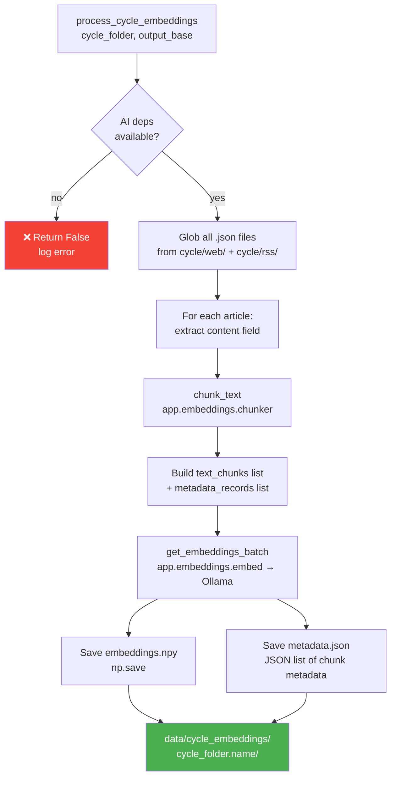

# 🗄️ `queue_embedder.py` — ⚠️ RETIRED Raw Embedding Generator

> **Path:** `app/input/news_pipeline/queue_embedder.py`
> **Status:** ⚠️ **RETIRED / UNUSED** — replaced by `app/embeddings/build_index.py`
> **Role (historical):** Read a scraped cycle folder, chunk article text, call Ollama embeddings, save raw `.npy` vectors + metadata to `data/cycle_embeddings/`.

---

## 📌 Overview

`queue_embedder.py` was an **early-stage embedder** that operated directly on scraper output (cycle folders) and saved raw NumPy vectors to disk — bypassing FAISS entirely.

It has been **retired** and its functionality replaced by the `app/embeddings/` layer (specifically `build_index.process_cycle()`), which is called by [`scheduler.py`](scheduler.md)'s `index_worker`.

> The file is kept for reference but **not called anywhere** in the current pipeline.

---

## 🔄 Historical Flow (No Longer Active)



---

## 📖 Function Reference

### `process_cycle_embeddings(cycle_folder, output_base) → bool`

| Parameter | Type | Description |
|-----------|------|-------------|
| `cycle_folder` | `Path` | Path to `indexing_queue/cycle_N_TIMESTAMP/` |
| `output_base` | `Path` | Root data directory |
| **Returns** | `bool` | `True` on success, `False` on failure |

**Steps:**
1. Check `chunk_text` and `get_embeddings_batch` imports (graceful degradation if Ollama deps missing)
2. Glob `cycle_folder/web/*.json` + `cycle_folder/rss/*.json`
3. For each article: extract `content` or `text` field → chunk via `chunk_text()`
4. Send all chunks to Ollama embeddings API via `get_embeddings_batch()`
5. Save `embeddings.npy` (raw float vectors) + `metadata.json` (chunk→article mapping)

---

## 📂 Output Format (Historical)

```
data/
└── cycle_embeddings/
    └── cycle_3_20240315_140000/
        ├── embeddings.npy     ← numpy array, shape (N_chunks, embed_dim)
        └── metadata.json      ← [{article_id, url, source, chunk_id, text}, ...]
```

### `metadata.json` record:
```json
{
  "article_id": "9a8f3d2e...",
  "url": "https://bbc.com/news/...",
  "source": "bbc_rss",
  "chunk_id": 0,
  "text": "The first chunk of article text..."
}
```

---

## ⚙️ Dependency Handling

```python
try:
    from app.embeddings.chunker import chunk_text
    from app.embeddings.embed import get_embeddings_batch
except ImportError as e:
    logger.error(f"Missing AI dependencies: {e}")
    chunk_text = None
    get_embeddings_batch = None
```

If either import fails, `process_cycle_embeddings()` returns `False` immediately — it never crashes the pipeline.

---

## ❌ Why It Was Retired

| Issue | Details |
|-------|---------|
| No FAISS integration | Saved raw `.npy` files but couldn't query them |
| Redundant | `build_index.process_cycle()` does the same + FAISS indexing |
| Disk waste | `.npy` files were not consumed by anything |
| Not called | `scheduler.py`'s `index_worker` uses `build_index.process_cycle` instead |

---

## 🔗 Cross-References

| Reference | Reason |
|-----------|--------|
| [`scheduler.py`](scheduler.md) | `index_worker` uses `build_index.process_cycle` instead of this |
| [`models.py`](models.md) | `DetailedArticleRecord` schema — articles read here match this shape |
| [`OVERVIEW.md`](OVERVIEW.md) | Full pipeline context |
