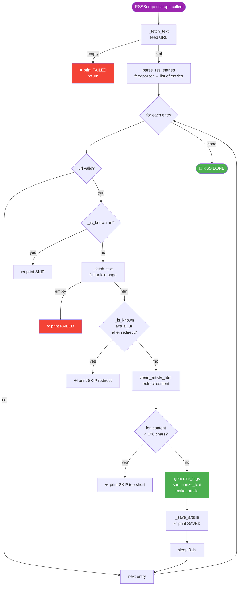

# 📡 `rss_scraper.py` — RSS Feed Parser & Article Extractor

> **Path:** `app/input/news_pipeline/scrapers/rss_scraper.py`
> **Role:** Fetches an RSS/Atom feed, parses all entries, then fetches and extracts the full article HTML for each new entry.
> **Extends:** [`BaseScraper`](base.md)
> **Used for:** Sources with `source_type="rss"` (e.g., BBC RSS, The Hindu RSS, TechCrunch RSS)

---

## 📌 Overview

`RSSScraper` is a **two-phase scraper**:
1. **Phase 1:** Fetch the RSS XML feed → parse all entry links + metadata (title, date)
2. **Phase 2:** For each new entry → fetch the full article page → extract body text

RSS entries give us **pre-identified article URLs** and often pre-known titles and publication dates — making this scraper more targeted than `WebScraper`.

---

## 🔄 Full Flow



---

## 📖 RSS vs Web Scraper Comparison

| Feature | `RSSScraper` | `WebScraper` |
|---------|-------------|-------------|
| URL discovery | From feed entries (pre-identified) | BFS link following |
| Depth | Fixed (feed entries only) | Infinite (entire domain) |
| Pre-known title | ✅ Yes (from feed) | ❌ No |
| Pre-known date | ✅ Yes (from feed) | ❌ No |
| Content threshold | 100 chars | 200 chars |
| Politeness delay | 0.1s | 0.15s |
| Volume | ~20–100 articles/cycle | Potentially thousands |

---

## 📖 Class Reference

### `RSSScraper(BaseScraper)`

```python
async def scrape(self) -> None
```

No additional public methods beyond `BaseScraper`.

---

## 🔗 Redirect Handling

After fetching an article page, the scraper checks the **actual URL** (after HTTP redirects) separately:

```python
article_html, actual_url = await self._fetch_text(url)

if self._is_known(actual_url):
    # e.g., RSS entry linked to /article/123 but server redirected to /news/article/123
    # the final URL is already in our database
    continue
```

This prevents duplicate articles when RSS feeds use tracking/redirect URLs.

---

## 💡 Example — What Gets Extracted from an RSS Entry

**RSS Feed XML input:**
```xml
<item>
  <title>India GDP grows 8.4% in Q3</title>
  <link>https://www.thehindu.com/business/Economy/india-gdp-grows/article123.cms</link>
  <pubDate>Fri, 15 Mar 2024 10:30:00 +0530</pubDate>
</item>
```

**After `parse_rss_entries()`:**
```python
{
    "url": "https://www.thehindu.com/business/economy/india-gdp-grows/article123.cms",
    "title": "India GDP grows 8.4% in Q3",
    "published_at": "2024-03-15T10:30:00"
}
```

**After full article fetch + extraction:**
```python
{
    "id":           "ab12cd34...",
    "url":          "https://www.thehindu.com/.../article123.cms",
    "title":        "India GDP grows 8.4% in Q3",   # from RSS (preferred)
    "text":         "India's gross domestic product...\n...",
    "hash":         "ef56gh78...",
    "source":       "the_hindu_rss",
    "category":     "india",
    "published_at": "2024-03-15T10:30:00",           # from RSS
    "scraped_at":   "2024-03-15T11:00:00.000000+00:00",
    "language":     "en",
    "tags":         ["gdp", "india", "economy", "growth", "q3"],
    "summary":      "India's gross domestic product expanded 8.4% year-on-year..."
}
```

---

## 💡 Example Console Output

```
======================================================================
📡 [RSS START] the_hindu_rss
   Feed: https://www.thehindu.com/news/feeder/default.rss
   Already in JSON: 127 articles
======================================================================

  📋 [ENTRIES]  the_hindu_rss        | Found 25 entries in feed
  🔍 [SCRAPING]  the_hindu_rss        | [1/25] https://www.thehindu.com/.../article1.cms
  ✅ [SAVED]    the_hindu_rss        | "India GDP Grows 8.4%..."
                                     | → app/input/data/rss/the_hindu_rss.json
  ⏭️  [SKIP]     the_hindu_rss        | Already in JSON: https://...article2.cms
  🔍 [SCRAPING]  the_hindu_rss        | [3/25] https://...article3.cms
  ...

======================================================================
🏁 [RSS DONE] the_hindu_rss
   Saved: 8 new articles
   Total in JSON: 135
======================================================================
```

---

## 🔗 Cross-References

| Reference | Reason |
|-----------|--------|
| [`base.py`](base.md) | `BaseScraper` parent — `_fetch_text`, `_is_known`, `_save_article`, `make_article` |
| [`extractors.py`](extractors.md) | `parse_rss_entries`, `clean_article_html`, `generate_tags`, `summarize_text` |
| [`scrapers/__init__.py`](scrapers_init.md) | `ScraperFactory` instantiates this for `source_type="rss"` |
| [`crawler.py`](crawler.md) | Creates one task per RSS source |
| [`config.py`](config.md) | RSS source definitions (~30 active RSS sources) |
| [`OVERVIEW.md`](OVERVIEW.md) | Full pipeline context |
