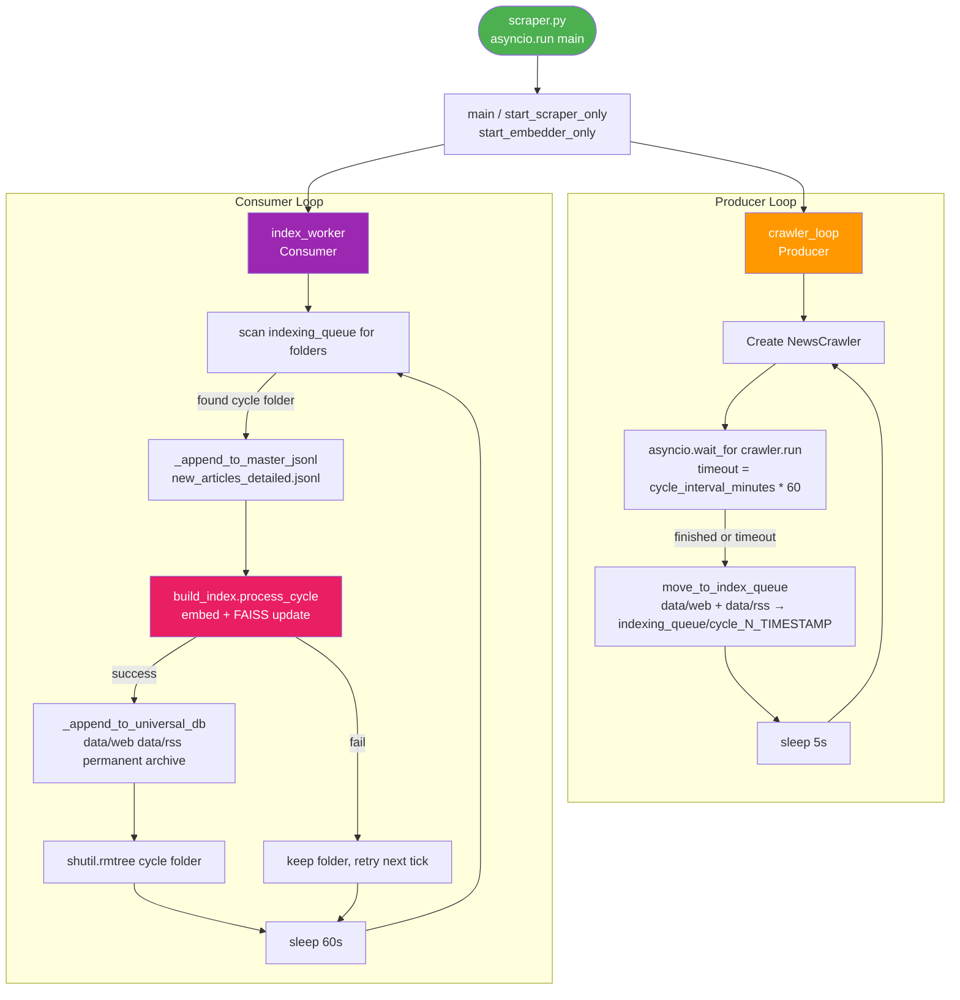
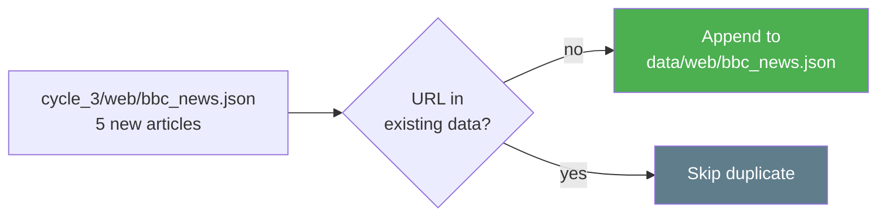

# ⏱️ `scheduler.py` — Producer & Consumer Orchestrator

> **Path:** `app/input/news_pipeline/scheduler.py`
> **Role:** Runs two concurrent async loops — a **Producer** (scraper) and a **Consumer** (index builder) — in a perpetual pipeline.
> **Called by:** [`scraper.py`](scraper.md) via `asyncio.run(main())`

---

## 📌 Overview

`scheduler.py` is the **brain of the pipeline**. It implements a classic **Producer–Consumer** pattern using two `asyncio` coroutines running concurrently:

| Loop | Coroutine | Role |
|------|-----------|------|
| 🏭 Producer | `crawler_loop()` | Runs `NewsCrawler` for `cycle_interval_minutes`, then moves output to `indexing_queue/` |
| 🧠 Consumer | `index_worker()` | Watches `indexing_queue/`, processes each cycle (embed → FAISS → universal DB → delete) |

---

## 🔄 Full Orchestration Flow



---

## 📖 Function Reference

### `crawler_loop(settings)` — 🏭 Producer

Runs forever. Each iteration = one **scraping cycle**.

```
cycle 1:
  [00:00] → Start NewsCrawler (all sources concurrently)
  [02:00] → Timeout reached OR crawl finished naturally
  [02:00] → move_to_index_queue() → indexing_queue/cycle_1_20240315_120000/
  [02:00] → sleep 5s
cycle 2:
  [02:05] → Start fresh NewsCrawler ...
```

**Hard timeout** via `asyncio.wait_for(..., timeout=cycle_duration_seconds)`:
- If the crawl finishes early → logged as "finished naturally"
- If 120 min pass → `TimeoutError` caught, crawler force-terminated

---

### `move_to_index_queue(output_base, cycle)` → `Path | None`

Moves `data/web/` and `data/rss/` into a timestamped cycle folder:

```
data/
├── web/bbc_news.json           ← moved to ↓
├── rss/bbc_rss.json            ← moved to ↓
└── indexing_queue/
    └── cycle_3_20240315_140000/
        ├── web/bbc_news.json
        └── rss/bbc_rss.json
```

Uses `shutil.move()` — the source directories are **consumed** (emptied), so the next crawler cycle starts with clean folders.

Returns `None` if no JSON files were found (empty cycle).

---

### `index_worker(output_base)` — 🧠 Consumer

Runs forever. Every 60 seconds it:

1. Scans `indexing_queue/` for subdirectories (sorted alphabetically = chronological)
2. For each cycle folder found:

| Step | Function | Output |
|------|----------|--------|
| A | `_append_to_master_jsonl()` | Appends all articles to `new_articles_detailed.jsonl` |
| B | `build_index.process_cycle()` | Embeds text + updates FAISS vector index |
| C | `_append_to_universal_db()` | Merges into permanent `data/web/` + `data/rss/` archive |
| D | `shutil.rmtree()` | Deletes cycle folder to free disk space |

If Step B fails (missing AI deps or embedding error) → folder is **kept** and retried next tick.

---

### `_append_to_master_jsonl(cycle_path, output_base)`

Reads every `.json` file in the cycle folder recursively.
Appends each article dict as one JSON line to `new_articles_detailed.jsonl`.

```jsonl
{"id": "abc123", "url": "https://...", "title": "...", ...}
{"id": "def456", "url": "https://...", "title": "...", ...}
```

---

### `_append_to_universal_db(cycle_path)`

Merges new articles into the **permanent** `data/web/` and `data/rss/` directories at project root.

- Deduplicates by URL — existing articles are never overwritten
- Preserves source-file grouping: `data/web/bbc_news.json`, `data/rss/bbc_rss.json`, etc.



---

### `start_scraper_only()` / `start_embedder_only()`

Convenience coroutines for running only half the pipeline:

```python
# Run only scraper (no indexing):
await start_scraper_only()

# Run only indexer (consume existing queue):
await start_embedder_only()
```

---

## ⏰ Timing Example

```
Timeline (2-hour cycles):
00:00 → Cycle 1 starts (crawler running)
02:00 → Cycle 1 timeout → data moved to queue
02:05 → Cycle 2 starts (crawler running)
02:06 → Consumer picks up cycle_1 folder
02:08 → Embeddings done, FAISS updated, cycle_1 deleted
04:05 → Cycle 2 timeout → data moved to queue
...
```

---

## 🔗 Cross-References

| Reference | Reason |
|-----------|--------|
| [`scraper.py`](scraper.md) | Calls `asyncio.run(main())` |
| [`crawler.py`](crawler.md) | `NewsCrawler` created and run inside `crawler_loop` |
| [`config.py`](config.md) | `load_settings()` called to get `CrawlSettings` |
| [`OVERVIEW.md`](OVERVIEW.md) | Full pipeline context |
