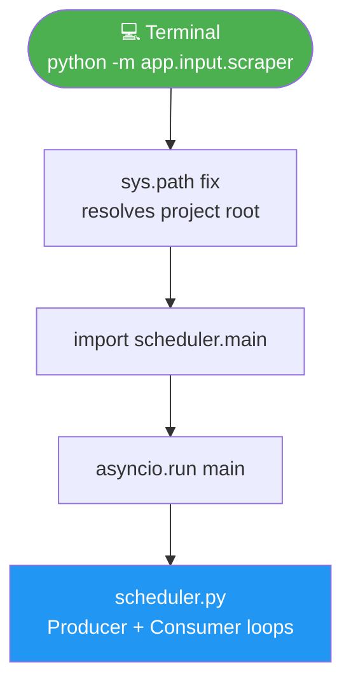

# 🚀 `scraper.py` — Pipeline Entry Point

> **Path:** `app/input/scraper.py`
> **Role:** CLI entry point that boots the full news scraping pipeline by calling `scheduler.main()`.
> **Run with:** `python -m app.input.scraper` from the project root.

---

## 📌 Overview

`scraper.py` is a **thin entry-point stub**. Its only job is to:
1. Fix the Python path so `app.*` imports resolve correctly regardless of CWD.
2. Import and `asyncio.run()` the `main()` coroutine from [`scheduler.py`](scheduler.md).

It contains **no logic** of its own — all orchestration lives in [`scheduler.py`](scheduler.md).

```python
import sys
from pathlib import Path

sys.path.insert(0, str(Path(__file__).resolve().parents[2]))

from app.input.news_pipeline.scheduler import main
import asyncio

if __name__ == "__main__":
    asyncio.run(main())
```

---

## 🔄 Execution Flow



---

## 🛠️ How to Run

```bash
# From project root:
python -m app.input.scraper

# Or directly:
cd /path/to/project
python app/input/scraper.py
```

The `sys.path.insert` ensures this works from **any working directory**.

---

## ⚙️ Path Resolution

```python
# __file__ is:  /project/app/input/scraper.py
# parents[0]  = /project/app/input/
# parents[1]  = /project/app/
# parents[2]  = /project/          ← inserted into sys.path
```

This lets Python resolve `from app.input.news_pipeline.scheduler import main` correctly.

---

## 🔗 Cross-References

| Reference | Reason |
|-----------|--------|
| [`scheduler.py`](scheduler.md) | Contains the `main()` coroutine that actually runs everything |
| [`crawler.py`](crawler.md) | Called by scheduler's producer loop |
| [`config.py`](config.md) | Settings loaded on first import |
| [`OVERVIEW.md`](OVERVIEW.md) | Full pipeline map |
