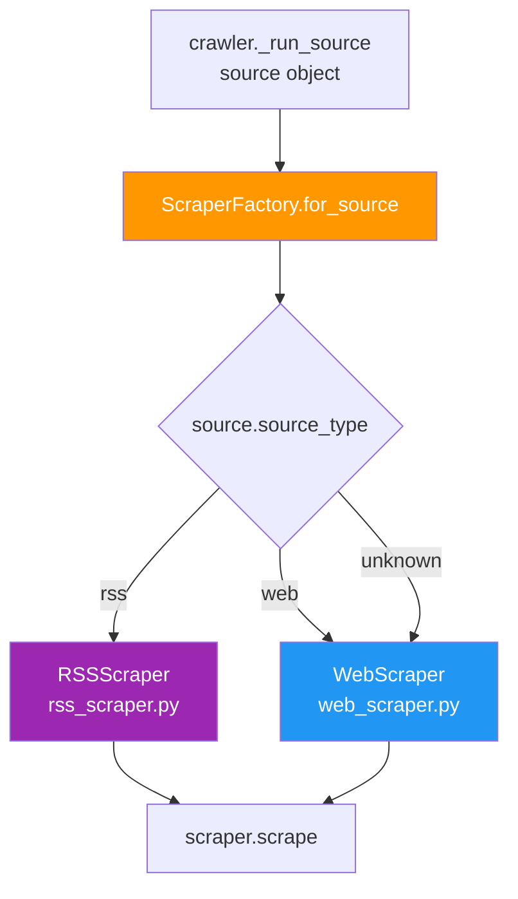

# 🏭 `scrapers/__init__.py` — ScraperFactory

> **Path:** `app/input/news_pipeline/scrapers/__init__.py`
> **Role:** Public surface of the `scrapers` sub-package. Exports `ScraperFactory`, which maps `source_type → scraper class` and instantiates the correct scraper.
> **Called by:** [`crawler.py`](crawler.md) → `_run_source()`

---

## 📌 Overview

`ScraperFactory` is a **registry-based factory** that hides scraper implementation details from the crawler. The crawler only needs to call `ScraperFactory.for_source(...)` — it doesn't need to know whether it's getting an RSS or Web scraper.

```python
class ScraperFactory:
    _REGISTRY: dict[str, type[BaseScraper]] = {
        "rss": RSSScraper,
        "web": WebScraper,
    }

    @classmethod
    def for_source(cls, source, session, settings, semaphore=None) -> BaseScraper:
        scraper_cls = cls._REGISTRY.get(source.source_type, WebScraper)
        return scraper_cls(source=source, session=session, settings=settings, semaphore=semaphore)
```

Unknown `source_type` values fall back to `WebScraper`.

---

## 🔄 Factory Routing



---

## 📖 Method Reference

### `ScraperFactory.for_source(source, session, settings, semaphore) → BaseScraper`

| Parameter | Type | Description |
|-----------|------|-------------|
| `source` | `Source` | The news source to scrape (from `config.py`) |
| `session` | `aiohttp.ClientSession` | Shared HTTP session |
| `settings` | `CrawlSettings` | All crawler configuration |
| `semaphore` | `asyncio.Semaphore \| None` | Global concurrency limiter |
| **Returns** | `BaseScraper` subclass | Ready-to-use scraper instance |

---

## 🔧 Extending with New Scrapers

To add a new scraper type (e.g., for GraphQL APIs or Playwright-based sites):

```python
# 1. Create app/input/news_pipeline/scrapers/graphql_scraper.py
class GraphQLScraper(BaseScraper):
    async def scrape(self) -> None:
        ...

# 2. Register in ScraperFactory._REGISTRY:
_REGISTRY = {
    "rss": RSSScraper,
    "web": WebScraper,
    "graphql": GraphQLScraper,   # ← add this
}

# 3. Add sources with source_type="graphql" in config.py
{"name": "my_api", "url": "https://...", "source_type": "graphql", "category": "world"}
```

---

## 📦 Exported Symbols

```python
from .scrapers import BaseScraper, RSSScraper, WebScraper, ScraperFactory
# re-exported from news_pipeline/__init__.py
```

---

## 🔗 Cross-References

| Reference | Reason |
|-----------|--------|
| [`crawler.py`](crawler.md) | Calls `ScraperFactory.for_source()` |
| [`base.py`](base.md) | `BaseScraper` — abstract contract all scrapers implement |
| [`rss_scraper.py`](rss_scraper.md) | `RSSScraper` implementation |
| [`web_scraper.py`](web_scraper.md) | `WebScraper` implementation |
| [`config.py`](config.md) | `Source` and `CrawlSettings` types passed to factory |
| [`OVERVIEW.md`](OVERVIEW.md) | Full pipeline context |
