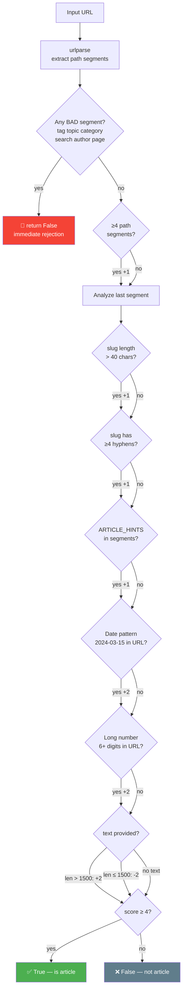

# 🔍 `test_classifier.py` — URL Article/Non-Article Classifier

> **Path:** `app/input/news_pipeline/test_classifier.py`
> **Role:** Heuristic scoring function that classifies a URL as a probable article page or a navigation/category/tag page.
> **Status:** Standalone test utility — not wired into the main scraping pipeline.

---

## 📌 Overview

`test_classifier.py` implements a **point-scoring heuristic** that analyzes URL structure (and optionally page text length) to decide if a URL is likely an article versus a listing/category/author page.

It's designed for use in BFS crawlers to filter out non-article pages before fetching — or to validate link quality post-fetch.

---

## 🔄 Scoring Flow



---

## 📖 Scoring Rules Reference

| Phase | Condition | Points |
|-------|-----------|--------|
| **1** | Any segment in `BAD_SEGMENTS` | → `False` (immediate) |
| **2** | Path has ≥ 4 segments | +1 |
| **3a** | Last segment > 40 chars | +1 |
| **3b** | Last segment has ≥ 4 hyphens | +1 |
| **4** | Any segment in `ARTICLE_HINTS` | +1 |
| **5** | Date pattern `20XX-XX-XX` in URL | +2 |
| **6** | Long number (6+ digits) in URL | +2 |
| **7a** | Page text provided AND len > 1,500 | +2 |
| **7b** | Page text provided AND len ≤ 1,500 | -2 |
| **Threshold** | **score ≥ 4** | → `True` |

### Bad Segments (Immediate Reject)
```python
BAD_SEGMENTS = {"tag", "topic", "category", "search", "author", "page"}
```

### Article Hint Segments (Boost)
```python
ARTICLE_HINTS = {"story", "article", "news", "video", "liveblog"}
```

---

## 💡 Examples

### ✅ Classified as Article

```python
# BBC article with date and long numeric ID
classify_url("https://www.bbc.com/news/world-europe-2024-03-15-68432187")
# → score: 1(segments) + 1(long slug) + 1(hyphens) + 1(news hint) + 2(date) + 2(long num) = 8 ✅

# The Hindu article with date path
classify_url("https://www.thehindu.com/news/national/2024/03/15/india-election-results/")
# → score: 1 + 1 + 2 = 4 ✅
```

### ❌ Classified as Non-Article

```python
# Category page
classify_url("https://www.bbc.com/news/category/world")
# → BAD_SEGMENT "category" → False immediately ❌

# Short author page
classify_url("https://www.thehindu.com/author/john-doe")
# → BAD_SEGMENT "author" → False immediately ❌

# Simple 2-segment URL
classify_url("https://www.bbc.com/news")
# → score: 0 < 4 → False ❌
```

---

## 📖 Function Reference

### `classify_url(url: str, text: str | None = None) → bool`

| Parameter | Type | Description |
|-----------|------|-------------|
| `url` | `str` | The URL to classify |
| `text` | `str \| None` | Optional fetched page text (for content-length phase) |
| **Returns** | `bool` | `True` = probable article, `False` = skip |

---

### `check_url(url: str)` ← interactive test loop

```python
def check_url(url):
    while True:
        url = input("enter url :")
        print(classify_url(url))
```

> ⚠️ This function has a bug: the `url` parameter is ignored — `input()` overwrites it immediately. It's a standalone interactive test loop.

---

## 🔗 Integration Notes

This classifier is **not currently called** by `web_scraper.py` or `rss_scraper.py`. In the current implementation, [`extractors.py`](extractors.md)'s `is_probable_article_url()` serves a similar (simpler) role. `test_classifier.py` provides a more **sophisticated scoring model** that could be wired in to reduce BFS noise.

**To integrate into `web_scraper.py`:**
```python
from ..test_classifier import classify_url

# In WebScraper.scrape(), before enqueuing a link:
if classify_url(link_url):
    queue.append(link_url)
```

---

## 🔗 Cross-References

| Reference | Reason |
|-----------|--------|
| [`web_scraper.py`](web_scraper.md) | BFS crawler that could benefit from this filter |
| [`extractors.py`](extractors.md) | `is_probable_article_url()` — simpler version of same concept |
| [`base.py`](base.md) | `_is_known()` — complementary URL dedup |
| [`OVERVIEW.md`](OVERVIEW.md) | Full pipeline context |
