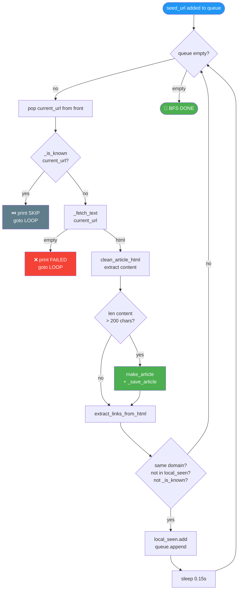
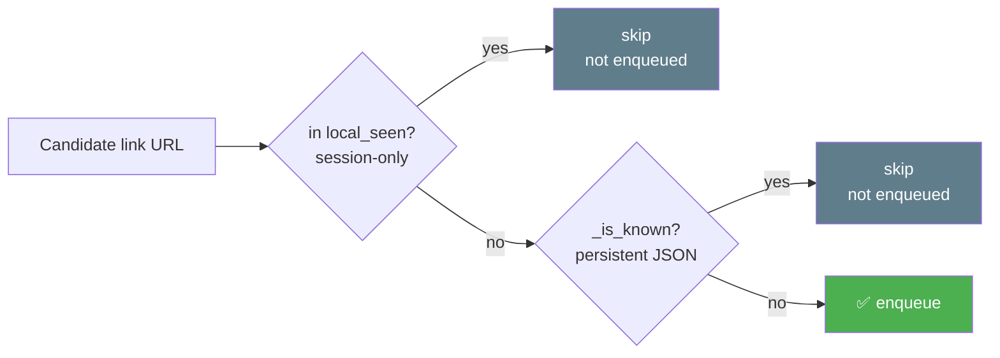

# 🌐 `web_scraper.py` — Infinite-Depth BFS Web Crawler

> **Path:** `app/input/news_pipeline/scrapers/web_scraper.py`
> **Role:** Crawls a web domain starting from a seed URL using **infinite-depth Breadth-First Search (BFS)**, extracting articles from every same-domain page.
> **Extends:** [`BaseScraper`](base.md)
> **Used for:** Sources with `source_type="web"` (e.g., BBC News, The Hindu, Times of India)

---

## 📌 Overview

`WebScraper` starts at a seed URL and **exhaustively crawls the entire domain** — following every same-domain link it finds, with no depth limit. It saves any page with substantial content (>200 chars) as an article.

This is **BFS, not DFS** — it processes all links at depth 1 before depth 2, ensuring the most prominent/linked pages are scraped first.

---

## 🔄 BFS Algorithm



---

## 📖 Two-Level Deduplication



| Set | Scope | Survives restart? |
|-----|-------|-------------------|
| `local_seen` | Current BFS session only | ❌ No |
| `self.known_urls` (from `base.py`) | Loaded from JSON file | ✅ Yes |

`local_seen` prevents adding the same URL to the queue twice **before** it's been fetched and saved. `known_urls` prevents re-fetching URLs **already saved** from previous runs.

---

## ⚙️ Domain Filtering

The crawler only follows **same-domain links**:

```python
seed_domain = urlparse(seed_url).netloc  # "www.bbc.com"

for link_url, _ in links:
    link_domain = urlparse(link_url).netloc
    if link_domain == seed_domain:       # must match exactly
        queue.append(link_url)
```

This means:
- ✅ `https://www.bbc.com/news/world-123` → enqueued
- ❌ `https://bbc.co.uk/...` → skipped (different domain)
- ❌ `https://reuters.com/...` → skipped (different domain)

---

## 📖 Class Reference

### `WebScraper(BaseScraper)`

```python
async def scrape(self) -> None
```

Runs the full BFS from `self.source.url`. No additional public methods.

---

## 📊 Content Threshold

Only pages with **>200 characters** of extracted text are saved as articles. This filters out:
- Navigation pages
- 404 pages
- Minimal content stubs
- Pages where extraction failed

> The RSS scraper uses a stricter threshold of **>100 characters** because RSS articles are pre-identified.

---

## 💡 Example Output

```
======================================================================
🌐 [WEB BFS START] bbc_news
   Seed: https://www.bbc.com/news
   Already in JSON: 342 articles
======================================================================

  🔍 [SCRAPING]  bbc_news             | (0 queued) https://www.bbc.com/news
  🔗 [LINKS]    bbc_news             | +47 new links, queue: 47
  🔍 [SCRAPING]  bbc_news             | (46 queued) https://www.bbc.com/news/world
  ✅ [SAVED]    bbc_news             | "UK Election Results Declared"
                                     | → app/input/data/web/bbc_news.json
  🔗 [LINKS]    bbc_news             | +12 new links, queue: 57
  ...

======================================================================
🏁 [WEB BFS DONE] bbc_news
   Visited: 1,247 pages | Saved: 893 articles
   Total in JSON: 1,235
======================================================================
```

---

## ⏱️ Politeness

A `0.15` second `asyncio.sleep` between requests ensures the scraper doesn't hammer any domain. Combined with the shared semaphore from [`base.py`](base.md), this keeps HTTP load reasonable.

---

## 🔗 Cross-References

| Reference | Reason |
|-----------|--------|
| [`base.py`](base.md) | `BaseScraper` parent — `_fetch_text`, `_is_known`, `_save_article`, `make_article` |
| [`extractors.py`](extractors.md) | `extract_links_from_html`, `clean_article_html`, `generate_tags`, `summarize_text` |
| [`scrapers/__init__.py`](scrapers_init.md) | `ScraperFactory` instantiates this class for `source_type="web"` |
| [`crawler.py`](crawler.md) | Creates one task per web source |
| [`config.py`](config.md) | Web source definitions (5 active web sources) |
| [`test_classifier.py`](test_classifier.md) | URL classifier that could filter BFS candidates |
| [`OVERVIEW.md`](OVERVIEW.md) | Full pipeline context |
